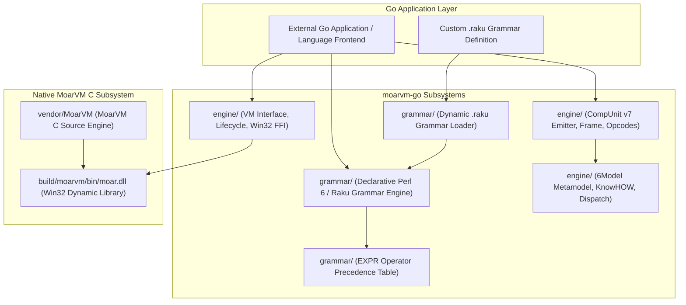

# moarvm-go - System Architecture & Requirements Specification (SPEC.md)

## 1. Executive Summary

`moarvm-go` is an enterprise-grade Go package and FFI binding for **MoarVM** (the 64-bit 6model virtual machine with JIT compilation). It provides a full CompUnit v7 bytecode emitter, 6Model metamodel representations, a declarative Perl 6 / Raku grammar and regex pattern matching engine, dynamic C FFI bindings to native `moar.dll`, and a mock engine for isolated unit testing.

---

## 2. Architecture Diagram



---

## 3. Subsystem Specifications

### 3.1 `engine` Subsystem (`moarvm-go/engine/`)

#### 3.1.1 VM Lifecycle & Win32 FFI Interface (`vm_windows.go`, `vm_mock.go`)
- **Native Dynamic Library Loading**:
  - Dynamically binds to `moar.dll` via `syscall.LoadLibrary` and resolves entry points via `syscall.GetProcAddress`.
  - Exported C API entry points:
    - `MVM_vm_create_instance()`: Allocates and initializes an `MVMInstance` structure with thread pool and garbage collector.
    - `MVM_vm_destroy_instance(instance)`: Tears down memory pools, finalizes active threads, and frees the instance.
    - `MVM_vm_run_file(instance, path)`: Loads and executes a `.moarvm` bytecode file from disk.
    - `MVM_vm_dump_bytecode(instance, path)`: Dumps bytecode assembly instructions for inspection.
- **Engine Interface Abstraction (`engine.go`)**:
  ```go
  type Engine interface {
      Init(ctx context.Context) error
      Destroy() error
      State() EngineState
      RunFile(ctx context.Context, path string) error
      RunBytecode(ctx context.Context, bc []byte) error
      SetProgName(name string) error
      SetArgs(args []string) error
      SetLibPaths(paths []string) error
  }
  ```
- **State Machine**:
  `UNINITIALIZED` $\rightarrow$ `READY` $\rightarrow$ `RUNNING` $\rightarrow$ `TERMINATED` / `ERROR`.

#### 3.1.2 CompUnit v7 Bytecode Emitter (`bytecode.go`, `opcodes.go`)
- **Binary Format Layout**:
  - 4-byte Magic Number: `MOAR` (`0x4D 0x4F 0x41 0x52`).
  - 4-byte Version: `7` (CompUnit Format Version 7).
  - String Heap: Length-prefixed UTF-8 string table.
  - Serialization Context (SC) Section: Object graph references and type mappings.
  - Frame Descriptors:
    - Local register count and register types (`RegInt64`, `RegNum64`, `RegStr`, `RegObj`).
    - Bytecode instruction stream (variable-length 16-bit opcode operands).
- **Opcode Catalog**:
  - Arithmetic: `OpConstI64`, `OpConstN64`, `OpConstS`, `OpAddI`, `OpSubI`, `OpMulI`, `OpDivI`, `OpModI`.
  - Control Flow: `OpGoto`, `OpIfI`, `OpUnlessI`, `OpReturn`, `OpReturnI`, `OpReturnS`, `OpReturnO`.
  - Object & Invocation: `OpCreate`, `OpFindMeth`, `OpInvokeV`, `OpInvokeO`.

#### 3.1.3 6Model Metamodel Engine (`sixmodel.go`)
- Implements the Raku/MoarVM 6Model object system:
  - **`KnowHOW`**: The root boot metamodel capable of creating primitive types and classes.
  - **`Class`**: Represents user-defined and built-in classes with attribute layout tables and method tables.
  - **`ParametricRole`**: Parametric roles with composition, conflict detection, and attribute flattening.
  - **Method Dispatch Tables**: Single and multiple dispatch resolution caching.

---

### 3.2 `grammar` Subsystem (`moarvm-go/grammar/`)

#### 3.2.1 Declarative Grammar Engine (`engine.go`, `match.go`, `context.go`)
- **Grammar Primitives**:
  - `rule`: Standard rule with implicit `:sigspace` whitespace skipping.
  - `token`: Exact regex token without automatic whitespace skipping.
  - `regex`: Backtracking pattern matcher.
- **Combinators & Character Classes**:
  - Character classes (`<[a..z0..9_]>`, `<-[0..9]>`).
  - Zero-width assertions: positive lookahead (`<?before ...>`), negative lookahead (`<!before ...>`), positive lookbehind (`<?after ...>`), negative lookbehind (`<!after ...>`).
  - Separated list combinators (`<elem> % <sep>`, `<elem> %% <sep>`).
- **Match Object Model (`Match`)**:
  - `Str`: Matched substring slice.
  - `From` / `To`: Character indices in source text.
  - `Named`: Named subrule captures map.
  - `Pos`: Positional captures slice (`$0`, `$1`, ...).
  - `Made`: AST payload produced by action methods (`make` / `$/.made`).

#### 3.2.2 Operator Precedence Climber (`expr_table.go`)
- Precedence parsing table for declarative expressions:
  - Precedence levels: tightest to loosest.
  - Associativity: `left`, `right`, `non`, `list`, `chain`.
  - Operator types: `prefix`, `postfix`, `infix`, `circumfix`, `postcircumfix`, `ternary`.

#### 3.2.3 Dynamic Grammar Loader (`loader.go`)
- Parses standalone `.raku` grammar files into executable `*grammar.Grammar` instances at runtime.
- Functions: `LoadGrammarFromString(source)` and `LoadGrammarFromFile(path)`.

---

## 4. Verification & Testing Standards

- **Unit Testing**: 100% test coverage across lifecycle, mock VM, CompUnit emitter, 6Model metamodel, and grammar combinators.
- **Dynamic FFI Validation**: Dynamic library calls verified against native `moar.dll` in `build/moarvm/bin/moar.dll`.
