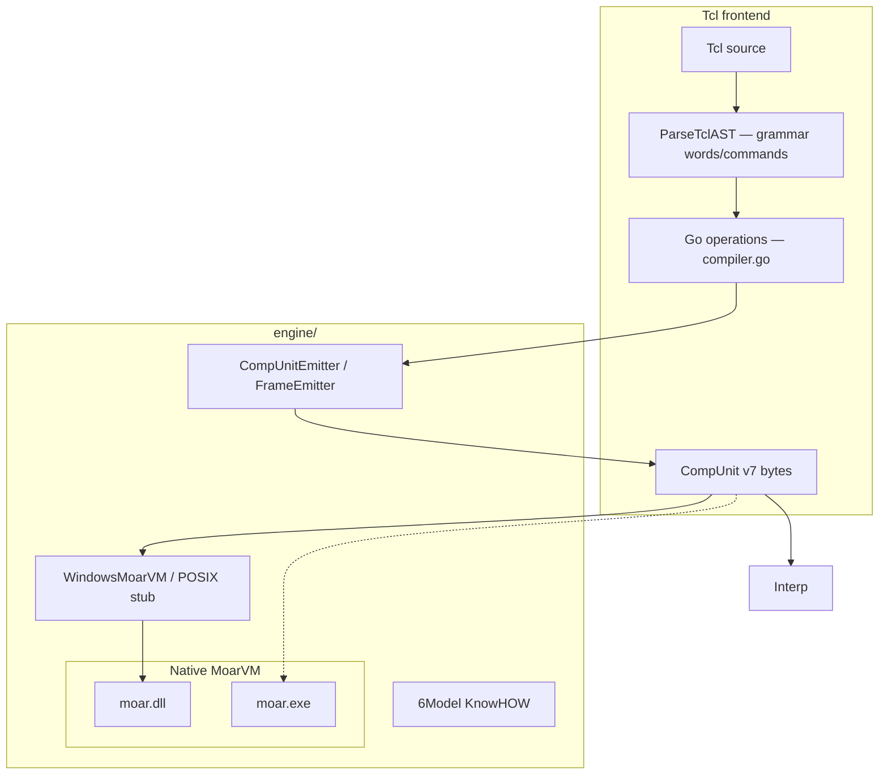

# moarvm-go — Architecture & binding audit (SPEC.md)

## 1. Purpose

`moarvm-go` embeds MoarVM from Go, emits CompUnit v7, and hosts a Tcl frontend whose **parse is grammatical**, **operations are Go compilers**, and **execution is MoarVM bytecode** (software interpreter or native `moar.dll`).

---

## 2. Architecture



**Invariant:** Go operations do not compute user-visible results for compiled commands. They emit `const_*`, arithmetic, compare, `goto` / `if_i` / `unless_i`, `say`, `concat_s`, `return_*`. The interpreter or VM produces output.

---

## 3. Engine bindings — what exists

### 3.1 Lifecycle (`vm_windows.go`)

| C symbol | Bound | Notes |
| :--- | :---: | :--- |
| `MVM_vm_create_instance` | yes | Pointer stored as `uintptr` |
| `MVM_vm_destroy_instance` | yes | |
| `MVM_vm_run_file` | yes | Return value ignored — failures are silent |
| `MVM_vm_set_clargs` | yes | Optional; missing symbol is ignored |
| `MVM_vm_set_prog_name` | yes | |
| `MVM_vm_set_lib_path` | yes | |

`RunBytecode` prefers `MVM_vm_run_bytecode` (in-memory). If that symbol is missing it writes a temp file and calls `MVM_vm_run_file`.

### 3.2 CompUnit emitter (`bytecode.go`)

Emits magic `MOARVM\r\n`, version 7, 96-byte header, frames (54-byte header + local types), string heap (UTF-8 flagged, 4-byte padded), empty SC / extop / callsite / annotation segments.

Jump operands are **absolute offsets from the start of the frame bytecode**, matching `interp.c` (`cur_op = bytecode_start + GET_UI32(...)`).

### 3.3 Opcodes (`opcodes.go`)

Register kinds and core opcode numbers match `src/core/ops.h` for: `const_i64` (4), `const_s` (7), `set` (8), `goto` (23), `if_i`/`unless_i` (24/25), `return_*` (51–55), integer ALU/compare, `concat_s` (208), `print` (494), `say` (495).

Execution is native: `FindMoarDLL` + `MVM_vm_run_bytecode` (in-process). `moar.exe` is only a fallback.

### 3.5 6Model (`sixmodel.go`)

In-Go KnowHOW / class / role tables. **Not** serialized into the CompUnit SC, so native MoarVM never sees these objects.

### 3.6 Grammar (`../gcre`)

**gcre** (Grammar Compatible Regular Expressions) is a sibling Go module: a **subset of Raku** grammar/regex notation that is **PEG-compatible**. Authors write `.raku` (no semantic actions). Tcl’s only grammar in this repo is [`tcl/tcl.raku`](tcl/tcl.raku). Other sample grammars live under [`../gcre/examples`](../gcre/examples). Parsing does **not** run on `moar.dll`.

---

## 4. Binding gaps (audit)

These are the important holes versus a production Moar embed:

1. **No in-memory bytecode entry point.** Moar exposes richer instance setup than `run_file`. There is no bind for running a buffer, installing an HLL, or setting a deserialize/load frame beyond header integers.
2. **`MVM_vm_run_file` errors discarded.** `Call()` HRESULT/errno is ignored; panics in the DLL can kill the process.
3. **Incomplete CompUnit.** Missing serialization context (SC) object graph, code objects, callsites, handlers, annotations, local debug names. Native `moar` typically cannot treat our files as a real HLL mainline.
4. **Opcode catalog is a subset** and was previously wrong for `say`/`print` (250/251 vs 495/494). Always regenerate numbers from `ops.h`.
5. **No extops / HLL config.** Tcl helpers are fake opcodes, not registered MVM extops.
6. **No GC / thread / dispatcher / spesh / JIT controls.**
7. **No exception or I/O capture from the native VM** (stdout is whatever the DLL writes).
8. **POSIX embed is a stub** relative to Windows `LoadDLL`.
9. **Grammar is not NQP on Moar.** A future step is compiling `tcl.raku` to NQP/Moar and parsing inside the VM.
10. **6Model not wired to SC.** Classes exist only in Go.
11. **Temp-file race / cleanup** on `RunBytecode`.
12. **Frame local types** are mostly `int64`; string ops reuse integer slots. Native validation may reject this.

---

## 5. Tcl frontend requirements

- **Parse** must go through `ParseTclAST` / `tcl.raku` (no `strings.Fields` compiler).
- **Operations** live in Go and emit frames via `CompUnitEmitter`.
- **Execute** in-process via `moar.dll` (`RunNative`). Compile error if a command cannot be emitted.
- `EvalHost` remains for FFI / `moar::*` only.
- Milestone 1: `EmitSayString("42")` + `moar.exe` prints `42` (`TestNativeMoarSays42`).
- Milestone 2–3, 5: `set` / `expr` / `puts` / `apply` (`getcode` + `takeclosure` + `dispatch_*` `boot-code`) / `proc` / `string` / lists run on `moar.exe`.
- Milestone 4: `coroutine` / `yield` emit `continuationreset` / `continuationcontrol` / `continuationinvoke`; native validation of lexical slots is still incomplete (tests skipped).
- Milestone 6: CLI and `Eval` no longer interpret in Go.
- **Closures:** `getcode` + `takeclosure` + `dispatch_*` `boot-code`.
- **Coroutines:** official continuation ops (native lexical layout still incomplete).

---

## 6. Verification

```powershell
go test ./...
go run ./cmd/tcl examples/demo_tcl.tcl
go run ./cmd/tcl -emit-only -o build/demo.moarvm examples/demo_tcl.tcl
```

Expected demo output:

```
Sum of 1..10 = 55
List count: 3
First item: Apple
```

Bytecode files must start with `MOARVM` and a little-endian version `7`.
