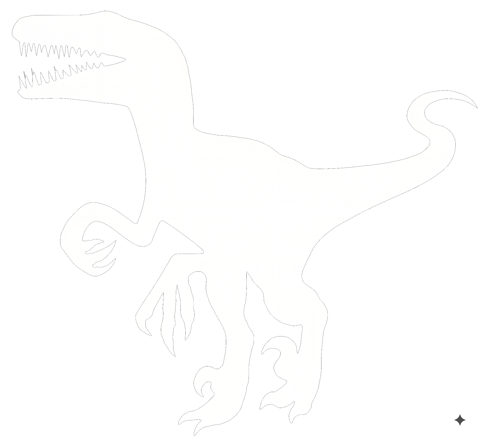

<p align="center">
  
</p>

# Raptor

Raptor is a post-LLM dynamic language — a Perl 5 subset of Raku targeting **MoarVM** in Go. Engineered for AI-assisted software generation, it combines high token density, verification-first contracts, continuous assignment predicate invariants, Uniform Function Call Syntax (UFCS), C-ABI struct memory, Charmbracelet terminal styling, literate programming with PodLit, and standalone binary packaging (`raptor pack`).

1. **Uniform Function Call Syntax (UFCS)**:
   Invoke any subroutine or multi-sub candidate using method invocation syntax on the first argument (`$val.func()`, `20.double()`, `"raptor".uc()`, `@list.map(...)`).
2. **Charmbracelet TUI & Terminal Styling Engine**:
   Lip Gloss ANSI 24-bit TrueColor styling (`tui_style`), framed boxes (`tui_box`), data tables (`tui_table`), progress bars (`tui_progress`), terminal markdown rendering (`tui_markdown`), and Bubble Tea state-machine event loops (`tui_app_run`).
3. **PortAudio Sound Engine & Waveform Synthesizer**:
    Real-time audio engine integration (`pa_init`, `pa_terminate`, `pa_device_count`, `pa_device_info`, `pa_sine_wave`).
4. **Native SQLite Database & Fast JSON**:
    Embedded database support (`sqlite_open`, `sqlite_exec`, `sqlite_query`, `sqlite_close`) and JSON serialization (`to_json`, `from_json`).
5. **Procedural Sockets Networking (TCP & UDP)**:
   Fast, low-level socket primitives: `tcp_listen`, `tcp_accept`, `tcp_connect`, `tcp_send`, `tcp_recv`, `tcp_close`, `udp_bind`, `udp_send`, `udp_recv`, and `tcp_close`.
6. **Sockets-Based HTTP/1.1 & RFC 6455 WebSockets**:
    Direct protocol implementation over sockets: `http_get`, `http_post`, `http_server_start`, `ws_frame_text`, `ws_parse_frame`.
7. **Raylib 5.5 Hardware Graphics Engine Integration**:
    60 FPS desktop window rendering with Windows x64 ABI struct-by-value packing and UTF-8 string marshalling ([examples/raylib_game.rp](examples/raylib_game.rp)).

Licensed under the **Artistic License 2.0**.

## Binaries & Build Artifacts

Pre-built executables and bundled runtime libraries ship in `raptor/bin/`; the WebAssembly target lives at `web/raptor.wasm`.

### Compiled from Go source

| Binary | Source | Description |
| :--- | :--- | :--- |
| **`bin/raptor.exe`** | `cmd/raptor/main.go` | Unified CLI: script runner, interactive REPL, MoarVM bytecode compiler (`raptor compile`), TAP test harness (`raptor test`), terminal manual reader (`raptor doc`), PodLit weave/tangle/stitch, package manager (`raptor init`/`get`/`install`), WebAssembly playground server (`raptor serve`), and standalone packager (`raptor pack`) |
| **`bin/raptorhp.exe`** | `cmd/raptorhp/main.go` | RaptorHP PHP-style embedded template engine & development web server: `raptorhp <file.phtml>`, `raptorhp -r "<code>"`, `raptorhp -S localhost:8000` |
| **`web/raptor.wasm`** | `cmd/wasm/main.go` | WebAssembly browser runtime exporting `raptorEval`, `raptorWeave`, `raptorTangle`, `raptorStitch`, and `raptorVersion`; served by `raptor serve` |

### Packaged applications (`raptor pack`)

`raptor pack <script.rp> -o <app.exe>` embeds a Raptor script plus the full runtime into a self-contained executable:

| Binary | Packed script | Description |
| :--- | :--- | :--- |
| **`bin/demo_app.exe`** | `examples/demo_showcase.rp` | Feature showcase: operator suite, C-structs, TUI styling, sockets, PortAudio synthesis, concurrency, environment globals |
| **`bin/raylib_game.exe`** | `examples/raylib_game.rp` | Interactive 60 FPS Raylib 5.5 desktop game window |

### Bundled runtime libraries (not built by this repository)

These DLLs are copied into `bin/` so every executable is zero-dependency. At runtime `ffi_load` searches `bin/`, the executable directory, and the system `PATH` (see `runtime/ffi.go`).

| Library | Origin | Used for |
| :--- | :--- | :--- |
| **`bin/moar.dll`** | Built from the MoarVM C source tree in `../moarvm-go/vendor/MoarVM` (see "Building from Source" below) | MoarVM 64-bit JIT / 6model engine executing `raptor compile` bytecode |
| **`bin/libraylib.dll`** | Raylib 5.5 from MSYS2 UCRT64 (`C:\msys64\ucrt64\bin\libraylib.dll`) | Raylib desktop graphics engine (`lib/Raylib.rp`, `examples/raylib_game.rp`) |
| **`bin/sqlite3.dll`** | SQLite from MSYS2 UCRT64 (`C:\msys64\ucrt64\bin\libsqlite3-0.dll`) | Native SQLite database (`sqlite_open`, `sqlite_query`, `sqlite_close`) |

## Building & Testing from Source

### Prerequisites

- **Go 1.22+** (developed and verified on Go 1.22–1.26 across Windows and Linux/WSL)
- **Local Module Link**: `go.mod` declares `replace moarvm-go => ../moarvm-go`, so `moarvm-go/` must reside adjacent to `raptor/`.

#### Package Dependencies by Operating System:
- **Alpine Linux / WSL**:
  ```sh
  apk add go gcc musl-dev sqlite-dev portaudio-dev git make perl
  ```
- **Debian / Ubuntu / WSL**:
  ```sh
  sudo apt update && sudo apt install -y golang gcc libsqlite3-dev libportaudio2 portaudio19-dev git make perl
  ```
- **Fedora / RHEL**:
  ```sh
  sudo dnf install -y golang gcc sqlite-devel portaudio-devel git make perl
  ```
- **Arch Linux**:
  ```sh
  sudo pacman -S go gcc sqlite portaudio git make perl
  ```
- **Windows**:
  - MSYS2 UCRT64 toolchain (`C:\msys64\ucrt64\bin`) with `gcc`, `raylib`, `sqlite3`.

---

### 1. Compile on Linux (WSL / Native)

```bash
cd raptor

# 1. Build Raptor unified CLI executable
go build -o bin/raptor ./cmd/raptor

# 2. Build RaptorHP template engine & web server
go build -o bin/raptorhp ./cmd/raptorhp

# 3. Build WebAssembly browser runtime (optional)
GOOS=js GOARCH=wasm go build -o web/raptor.wasm ./cmd/wasm
```

#### Run Tests & Verification on Linux:
```bash
# Run all Go unit test suites
go test -v ./...

# Run the complete TAP test harness (6 test files, 47 assertions)
./bin/raptor test t/

# Run the comprehensive feature showcase
./bin/raptor run examples/demo_showcase.rp

# Execute a one-liner
./bin/raptor -e 'say "Hello from Raptor on Linux!"; my @arr = [10, 20, 30]; say "Elements: " ~ @arr.elems();'

# Start the RaptorHP template server
./bin/raptorhp -S localhost:8000
```

---

### 2. Compile on Windows (PowerShell)

```powershell
cd raptor

# 1. Build executables
go build -o bin/raptor.exe ./cmd/raptor
go build -o bin/raptorhp.exe ./cmd/raptorhp

# 2. Build WebAssembly browser runtime
$env:GOOS = "js"; $env:GOARCH = "wasm"
go build -o web/raptor.wasm ./cmd/wasm
Remove-Item Env:GOOS, Env:GOARCH

# 3. Package standalone applications (optional)
.\bin\raptor.exe pack examples\demo_showcase.rp -o bin\demo_app.exe
.\bin\raptor.exe pack examples\raylib_game.rp -o bin\raylib_game.exe
```

#### Run Tests & Verification on Windows:
```powershell
go test ./...                      # Go unit test suites
.\bin\raptor.exe test t\           # Raptor TAP test harness (6 files, 47 assertions)
.\bin\raptor.exe -e 'say "Hello, Raptor!"'
.\bin\raptorhp.exe -r '<b><?= 6 * 7 ?></b>'
.\bin\raptorhp.exe -S localhost:8000   # development template server
```

## Key Features

1. **Pure Dynamic Typing & No-OO Architecture**:
   Built on dynamic variables (`$scalar`, `@array`, `%hash`), subroutines, modules, first-class functions, and C-structs without `class`, `has`, or `is` keyword overhead.
2. **Uniform Function Call Syntax (UFCS)**:
   Invoke any subroutine or multi-sub candidate using method invocation syntax on the first argument (`$val.func()`, `20.double()`, `"raptor".uc()`, `@list.map(...)`), enabling clean functional pipelines and method chaining without OOP classes.
3. **Perl5 TAP Testing Framework & Test Harness (`raptor test`)**:
   Standard Test Anything Protocol v13 producer (`plan`, `ok`, `is`, `isnt`, `is_deeply`, `like`, `unlike`, `cmp_ok`, `subtest`, `done_testing`) and test harness runner (like `prove`).
4. **Verification-Friendly Architecture**:
   Zero-overhead inline tests (`TEST "desc" { ... }`), Design-by-Contract (`pre`, `post`, `invariant`), and Property-Based QuickCheck fuzzing (`property "name", sub ($a, $b) { ... }`).
5. **PodLit Literate Programming Subsystem (Weave, Tangle, Mangle & Stitch) & `raptor doc`**:
    Knuth-style literate programming via extended POD: weave Markdown docs (`raptor weave`), tangle executable source code with macro chunk expansion (`raptor tangle`), reverse-tangle modified code back into POD (`raptor stitch`), apply mangle filters, and directly execute `.pod` documents ([examples/literate_game.pod](examples/literate_game.pod)).
   Comprehensive manual documentation in `docs/` rendered directly in the terminal with ANSI colors: `raptor doc operators`, `raptor doc subsets`, `raptor doc tui`, `raptor doc structs`.
6. **C-ABI Struct Records & Function Pointers**:
   C memory layout records (`struct Point { int32 $x; int32 $y; }`) with first-class function pointer / closure fields (`$btn.onClick = sub ($v) { ... }; $btn.onClick(42)`).
7. **Dynamic Refinement Types (`subset`) & Predicate Dispatching**:
   Enforce dynamic value invariants using Raku-style `subset` and `where` predicates (`subset Positive where { $_ > 0 }`, `multi sub fib($n where { $n <= 1 })`).
8. **Custom Operator Overloading on Structs**:
   Seamless multi-dispatch overloading for structs (`multi sub infix:<+>(Vec2 $a, Vec2 $b)`, `multi sub prefix:<->(Vec2 $v)`).
9. **Comprehensive Perl5 & Raku Operator Suite**:
    Defined-or (`//`, `//=`), Exponentiation (`**`), Ternary (`?? !!`, `? :`), Bitwise numeric (`+&`, `+|`, `+^`, `+<`, `+>`), Repetition (`x`, `xx`), Divisibility (`div`, `mod`, `%%`), Min/Max (`min`, `max`), File tests (`-e`, `-f`, `-d`, `-s`, `-r`, `-w`), and Regex (`=~`, `!~`).
10. **Advanced Concurrency & Atomics**:
    `Mutex`, `Semaphore`, `WaitGroup`, `parallel_map`, reactive `Supply` streams, `Promise` (`start { ... }`), `Channel`, and hardware atomic primitives.
11. **Raptor Package Manager (`raptor init`, `raptor get`, `raptor install`)**:
    Git-based package management cloning dependencies directly into `./raptor_modules/` with automatic runtime module discovery.
12. **Standalone Binary Packaging & Bundled DLLs**:
    Package any script into a self-contained `.exe` executable (`raptor pack`), with `moar.dll`, `libraylib.dll`, and `sqlite3.dll` residing directly in `bin/` for zero-dependency portability.
13. **WebAssembly (Wasm) In-Browser IDE & REPL**:
    Run 100% client-side in the browser via `web/raptor.wasm`, featuring interactive REPL prompt, code playground, presets, and live PodLit literate inspector (`raptor serve`).

## Quick Start

```powershell
# 1. Run the comprehensive feature showcase
.\bin\raptor.exe run examples/demo_showcase.rp

# 2. Launch the WebAssembly In-Browser REPL & Playground
.\bin\raptor.exe serve --port 8080
# Open http://localhost:8080/ in your browser!

# 3. Run the interactive 60 FPS Raylib desktop game GUI window
.\bin\raptor.exe run examples/raylib_game.rp

# 4. Weave, tangle, and stitch a Literate POD document
.\bin\raptor.exe weave examples/literate_game.pod -o docs/literate_game.md
.\bin\raptor.exe tangle examples/literate_game.pod -o src/
.\bin\raptor.exe stitch examples/literate_game.pod src/lib/LiterateTypes.rp
.\bin\raptor.exe run examples/literate_game.pod

# 5. Run the performance benchmark suite
.\bin\raptor.exe run examples/benchmark.rp

# 6. Run the TAP test harness across all test suites (like prove)
.\bin\raptor.exe test t/

# 7. Read terminal documentation manual with ANSI styling
.\bin\raptor.exe doc operators
.\bin\raptor.exe doc 01_introduction

# 8. Package into a standalone executable (.exe)
.\bin\raptor.exe pack examples/raylib_game.rp -o bin/raylib_game.exe
.\bin\raptor.exe pack examples/demo_showcase.rp -o bin/demo_app.exe

# 9. Execute the standalone executable directly
.\bin\raylib_game.exe
.\bin\demo_app.exe

# 10. Start the interactive terminal REPL
.\bin\raptor.exe

# 11. Run the PHP-Style Template Server (RaptorHP)
.\bin\raptorhp.exe -r '<h1><?= "Hello from RaptorHP" ?></h1>'
.\bin\raptorhp.exe -S localhost:8000

# 12. Run the Interactive WebAssembly Playground & 13-Lesson Go Tour
.\bin\raptor.exe serve 8085

# 13. Run full Go test suite across all subsystems
go test -v ./...
```

## Interactive WebAssembly Tour & In-Browser Execution

Raptor includes a 1:1 Go Tour-style interactive WebAssembly environment (`web/index.html`):
- **13 Interactive Chapters**: Covering basic operators, dynamic subsets, C-structs, UFCS pipelines, autothreading quantum junctions, destructuring, generators, verification contracts, PodLit literate programming, HTML5 Canvas 2D, WebGL 3D, and WebAudio.
- **Pure Raptor Graphics & Audio**: The GLSL shaders, 3D cube vertex geometry, 4x4 matrix math (`sin`, `cos`, `tan`, `$pi`), procedural 2D radar HUD, and ADSR audio envelopes are authored **100% in pure Raptor code**. The C and JS layers strictly provide low-level zero-overhead primitives (`gl_*`, `canvas_*`, `audio_*`, `ffi_*`).
- **Resizable Multi-Pane Workspace**: Drag-to-resize split gutters and 2-axis scrollbar canvas viewport.

## Embedded Systems, ESP32 Microcontrollers & TinyGo

Raptor compiles directly to bare-metal microcontrollers (such as **ESP32**, **ESP32-S3**, **ESP32-C3**, and **RP2040**) using TinyGo and embedded build profiles:

```powershell
# 1. Run automated binary size optimization & stripped builds
powershell -ExecutionPolicy Bypass -File .\scripts\build_optimized.ps1

# 2. Run embedded examples on host (simulated hardware peripherals)
.\bin\raptor.exe run examples/esp32_blink.rp
.\bin\raptor.exe run examples/esp32_sensor_contracts.rp
.\bin\raptor.exe run examples/esp32_i2c_display.rp

# 3. Flash to ESP32 board via TinyGo over USB/Serial
tinygo flash -target=esp32 --port=/dev/ttyUSB0 ./cmd/esp32
tinygo flash -target=esp32s3 ./cmd/esp32
```

### Embedded Hardware Features:
- **Low Footprint**: ~380 KB Flash binary, ~45 KB RAM runtime heap.
- **Physical I/O Primitives**: `gpio_pin_mode`, `gpio_set`, `gpio_get`, `gpio_toggle`, `analog_read`, `pwm_write`, `pwm_freq`, `i2c_write`, `i2c_read`, `spi_transfer`.
- **UART Serial REPL**: Boots directly into an interactive `raptor>` prompt over 115200 baud serial connection.
- **Continuous Hardware Invariants**: Enforces dynamic `subset` contracts (e.g. valid pin bounds, duty cycles, thermal limits) directly on physical actuators.

### Interactive 14-Lesson WebAssembly Tour & Micro-Deployment

Raptor's core evaluation engine has zero reflection overhead, making it directly compatible with the TinyGo LLVM toolchain for ultra-compact deployments:

| Target Profile | Toolchain & Profile | Raw Unstripped Size | Optimized Build Size | Over-The-Wire (Gzip / Brotli) | Target Platform |
| :--- | :--- | :--- | :--- | :--- | :--- |
| **Native CLI (Full)** | Standard Go `gc` (`-ldflags="-s -w"`) | **11.78 MB** | **7.95 MB** | **2.60 MB** | Windows / Linux / macOS (x86_64/ARM64) |
| **WebAssembly 14-Lesson Tour** | TinyGo LLVM (`-target=wasm -no-debug`) | **1.38 MB** | **1.38 MB** | **468 KB** (Brotli: ~380 KB) | Modern Web Browsers (WebAssembly) |
| **WebAssembly Standard (`gc`)** | Tree-Shaken Go `gc` (`-ldflags="-s -w"`) | **14.20 MB** | **6.05 MB** | **1.21 MB** (Brotli: ~980 KB) | Web Browsers & Node.js WASM |
| **ESP32 Microcontroller** | TinyGo LLVM (`-target=esp32`) | **850 KB** | **380 KB** | N/A (Direct Flash) | ESP32, ESP32-S3, ESP32-C3, RP2040 |

#### TinyGo WASM Build Command:
```bash
tinygo build -target=wasm -no-debug -o web/raptor.wasm ./cmd/wasm
```

## Notes

The language was mostly written by Anti Gravity - Gemini 3.6. Library bindings, podlit are written by Gemini 3.7.

Built on windows. It should work on Linux. Expect bugs, memory leaks and probably some wrong semantics. Future versions will make it closer to Raku.


