  

# Raptor Software Requirements Specification & System Architecture (SPEC.md)

## 1. System Overview & Architecture

Raptor is a high-performance execution platform and language runtime designed with a **pure dynamic typing model (Perl5 subset of Raku with no OO)**, **`.rp` and `.raptor` file extension syntax**, **C-struct memory layout**, **Charmbracelet TUI engine**, **Perl5 TAP testing framework**, and **verification contracts**. It targets 64-bit native execution, dynamic libraries via C FFI (NativeCall), sockets networking, real-time PortAudio sound synthesis, native SQLite databases, Raylib 5.5 desktop GUI rendering, and standalone single-binary compilation (`raptor pack`).

```mermaid
flowchart TD
    subgraph RaptorRunners [CLI, Test Harness & Packager: cmd/raptor]
        RaptorCLI["raptor.exe (CLI, REPL, Runner, Packager)"]
        TestHarness["raptor test (TAP Test Harness like prove)"]
        DocReader["raptor doc (Terminal Markdown Manual)"]
        PackagedApp["bin/app.exe (Self-Contained Executable)"]
    end

    subgraph RaptorRuntime [Raptor Core Runtime Subsystem]
        Parser["runtime/parser.go (Pratt Precedence Parser)"]
        Lexer["runtime/lexer.go (Token Scanner, Hex, Regex)"]
        Interp["runtime/eval.go (AST Evaluator & Dispatcher)"]
        Operators["runtime/eval.go (Perl5 & Raku Operator Suite)"]
        PredicateDispatch["runtime/eval.go (where & subset Dynamic Dispatch)"]
        StructClosures["runtime/eval.go (Struct Function Pointers & Closures)"]
        Junctions["runtime/value.go (all, any, one, none Autothreading)"]
        Destruct["runtime/eval.go (Array & Hash Signature Destructuring)"]
        Advices["runtime/eval.go (before, after, around Multimethod AOP)"]
        TAPProducer["runtime/tap.go (plan, ok, is, is_deeply, subtest, done_testing)"]
        Verification["runtime/verification.go (pre, post, invariant, TEST, property)"]
        TUIEngine["runtime/tui.go (Lip Gloss ANSI Styling, Boxes, Tables, Bubble Tea)"]
    end

    subgraph StandardModules [Built-in Procedural Engines]
        Sockets["runtime/socket.go (TCP & UDP Sockets)"]
        HTTP_WS["runtime/http.go, websocket.go (HTTP/1.1 & RFC 6455 WS)"]
        PortAudioEng["runtime/portaudio.go (PortAudio V19 Engine & Synth)"]
        SQLiteEng["runtime/sqlite.go (Native SQLite3 Engine)"]
        JSONEng["runtime/json.go (Fast JSON Serializer)"]
        ConcurrencyEng["runtime/concurrency.go (Mutex, Sem, WG, Supply, PMap)"]
        BaseBuiltins["runtime/builtins.go (Perl5/Raku Math, String, FS, Env)"]
        FFIEngine["runtime/ffi.go (NativeCall, Small Struct ABI, Callbacks)"]
        CompilerEng["runtime/compiler.go (AST to MoarVM Bytecode)"]
    end

    subgraph NativeLayer [Native Dynamic Libraries & OS]
        RaylibDLL["raylib.dll (Raylib 5.5 OpenGL Desktop Graphics)"]
        PortAudioDLL["libportaudio-2.dll / PortAudio V19"]
        SQLiteDLL["winsqlite3.dll (Win10/11) / sqlite3.dll"]
        MoarDLL["moar.dll (MoarVM 6Model Engine)"]
        WinSock["ws2_32.dll / OS Network Stack"]
    end

    RaptorCLI --> Interp
    TestHarness --> Interp
    DocReader --> TUIEngine
    PackagedApp --> Interp
    Interp --> Parser
    Parser --> Lexer
    Interp --> Operators
    Interp --> PredicateDispatch
    Interp --> StructClosures
    Interp --> Junctions
    Interp --> Destruct
    Interp --> Advices
    Interp --> TAPProducer
    Interp --> Verification
    Interp --> TUIEngine
    Interp --> Sockets
    Interp --> HTTP_WS
    Interp --> PortAudioEng
    Interp --> SQLiteEng
    Interp --> JSONEng
    Interp --> ConcurrencyEng
    Interp --> BaseBuiltins
    Interp --> FFIEngine
    Interp --> CompilerEng
    FFIEngine --> RaylibDLL
    PortAudioEng --> PortAudioDLL
    SQLiteEng --> SQLiteDLL
    Sockets --> WinSock
    CompilerEng --> MoarDLL
```

---

## 2. Licensing & Open Source Policy

Raptor and MoarVM-Go are licensed under the **Artistic License 2.0** (`raptor/LICENSE`, `moarvm-go/LICENSE`).

---

## 3. Charmbracelet TUI & Terminal Styling Subsystem

The TUI subsystem (`runtime/tui.go`, `lib/Charm.raku`) provides:
1. **Lip Gloss ANSI Styling (`tui_style`)**: 24-bit TrueColor Hex/RGB codes (`#38bdf8`), background colors, bold, dim, italic, underline, strikethrough, padding, margins, borders (`rounded`, `double`, `thick`, `normal`), and alignment (`left`, `center`, `right`).
2. **Framed Boxes (`tui_box`)**: Formatted framed boxes with custom border styles and titles.
3. **Data Tables (`tui_table`)**: ASCII/Unicode data tables with header styling and alternate row dimming.
4. **Progress Bars (`tui_progress`)**: Progress indicators with custom widths and colors.
5. **Terminal Markdown Rendering (`tui_markdown`)**: Full markdown renderer with syntax highlighted code frames and styled headers.
6. **Bubble Tea State-Machine Runner (`tui_app_run`)**: Elm architecture Model-Update-View interactive applications.

---

## 4. Perl5 TAP Testing & Test Harness (`raptor test`)

The TAP subsystem (`runtime/tap.go`, `lib/Test/More.raku`) implements the Test Anything Protocol (v13):
- `plan($count)`: Sets planned test assertions (`1..N`).
- `ok($cond, [$name])`: Asserts boolean condition.
- `is($got, $expected, [$name])`: Asserts equality with diagnostic diffs.
- `isnt($got, $expected, [$name])`: Asserts inequality.
- `is_deeply($got, $expected, [$name])`: Structural recursive equality on arrays, hashes, and structs.
- `like($got, $regex, [$name])` / `unlike(...)`: Pattern matching assertions.
- `cmp_ok($got, $op, $expected, [$name])`: Generic operator comparisons.
- `pass([$name])` / `fail([$name])`: Direct pass/fail reporting.
- `diag($msg)`: Emits diagnostic comments (`# ...`).
- `subtest($name, $closure)`: Nested indented TAP test suites.
- `done_testing([$count])`: Emits trailing plan and verifies results.
- `raptor test [t/*.t]`: Harness runner discovering all test files, parsing TAP streams, and reporting suite statistics.

---

## 5. Verification Framework: Inline Tests, Contracts & Fuzzing

The verification engine (`runtime/verification.go`, `docs/09_testing_and_verification.md`) provides:
1. **Zero-Overhead Inline Tests (`TEST "desc", sub () { ... }`)**: Skipped with zero overhead in production; executed automatically during `raptor test` or with `--test`.
2. **Design-by-Contract (`pre`, `post`, `invariant`)**: Preconditions and postconditions checked at subroutine entry/return.
3. **Property-Based QuickCheck Fuzzing (`property "name", sub ($a, $b) { ... }`)**: Invariant verification across 100 randomized input trials.

---

## 6. Perl5-Style Markdown Documentation Suite

Comprehensive manual guides in `docs/` readable via `raptor doc <topic>`:
- `docs/01_introduction.md`: Runtime architecture, philosophy, and quickstart.
- `docs/02_syntax_and_types.md`: Dynamic variables, first-class closures, and parameter destructuring.
- `docs/03_operators.md`: Complete guide to all Perl5 & Raku operators.
- `docs/04_subsets_and_contracts.md`: Dynamic refinement types and Predicate Dispatching.
- `docs/05_structs_and_ffi.md`: C-ABI structs, function pointers, NativeCall, and Raylib.
- `docs/06_tui_and_styling.md`: Charmbracelet Lip Gloss styling, boxes, tables, and Bubble Tea.
- `docs/07_networking_and_io.md`: Sockets, HTTP, WebSockets, SQLite, and JSON.
- `docs/08_concurrency_and_audio.md`: Promises, Channels, Atomics, and PortAudio audio synthesis.
- `docs/09_testing_and_verification.md`: TAP test framework, inline tests, and contracts.

---

## 7. Verification & Test Metrics

- **Unit Test Suite**: 58 test suites in `runtime/` pass with 100% success rate.
- **TAP Test Suite**: 6 test scripts in `t/` (47 assertions) pass with 100% success rate (`raptor test t/`).
- **Standalone Binary Packager & DLLs**: `raptor pack <script> -o <bin.exe>` produces self-contained executables; `bin/` contains `libraylib.dll`, `moar.dll`, and `sqlite3.dll` for zero-dependency distribution.

---

## 8. Performance Architecture & Benchmarks

1. **Value Flyweight Pattern**:
   - Static singleton references for `ValNil`, `ValBool(true)`, `ValBool(false)`, and `ValString("")` eliminating redundant heap allocations in conditionals and boolean evaluations.
2. **Fast-Path Operator Dispatch**:
   - Guarded custom operator lookup tables (`CustomInfixOps`, `CustomPrefixOps`) enabling native integer, float, and string arithmetic to execute with zero string allocations and zero map lookups.
3. **Lexical Loop Environment Frame Recycling**:
   - Reused lexical scope frames across `while`, `for`, and `loop` iterations, saving millions of heap map allocations in tight loops.
4. **$O(1)$ C-ABI Struct Field Indexing**:
   - Precomputed `FieldIndex map[string]int` on `CStructDeclStmt` providing instant $O(1)$ member access.
5. **Benchmarks**:
   - `1,000,000` iteration arithmetic loop: completed in ~1.0s.
   - `500,000` C-struct field mutations: completed in < 0.1s.
   - `fib(24)` recursive subroutine dispatch: completed in < 0.1s.

---

## 9. PodLit Literate Programming Subsystem (Weave, Tangle, Mangle & Stitch)

- **POD-Based Syntax**: Extended POD directives (`=pod`, `=head1..=head6`, `=chunk <name> [:file "path"] [:mangle(...)]`, `=end chunk`, `=cut`).
- **Weave Engine**: Translates human narrative prose and labeled code snippets into formatted GitHub-Flavored Markdown (`raptor weave <file.pod> -o <doc.md>`).
- **Tangle Engine**: Recursively resolves named chunk references (`<<chunk-name>>`), aligns caller indentation, detects circular references, and writes source files to disk (`raptor tangle <file.pod> -o <dir>`).
- **Mangle Pipeline**: Code transformation filters (`indent(N)`, `strip_comments`, `prefix("...")`).
- **Stitch Engine**: Reverse-tangles modified source files back into the original `.pod` literate document (`raptor stitch <file.pod> <source> [-o <out.pod>]`), preserving 100% of narrative prose, headings, and formatting.
- **Direct Execution**: Run literate documents directly in-memory via `raptor <file.pod>` or `raptor run <file.pod>`.

---

## 10. WebAssembly (Wasm) Compilation Target & In-Browser IDE/REPL

Raptor compiles directly to WebAssembly (`GOOS=js GOARCH=wasm`) with zero external backend dependencies:
- **Wasm Entrypoint (`cmd/wasm/main.go`)**: Exports standard JavaScript bridge functions (`window.raptorEval`, `window.raptorWeave`, `window.raptorTangle`, `window.raptorStitch`, `window.raptorVersion`).
- **Web REPL Architecture (`web/`)**:
  - `web/index.html`: Responsive, dark-themed terminal IDE with JetBrains Mono / Inter fonts, Raptor branding, REPL console, code playground, and PodLit inspector.
  - `web/style.css`: Modern styling (dark palette, emerald accents, glassmorphism headers, responsive split layout).
  - `web/app.js`: REPL history loop, multi-tab management, live execution, syntax presets (Subsets, Structs, Junctions, Literate Game).
  - `web/wasm_exec.js`: Go WebAssembly runtime bridge.
- **Local Web Server (`raptor serve`)**: Built-in HTTP server serving `web/` with proper `application/wasm` MIME type on port 8080.

---

## 11. MoarVM 64-Bit Bytecode Compilation Engine

- **Bytecode Generator (`runtime/compiler.go`)**: Compiles Raptor AST directly into MoarVM version 7 Compilation Units (`.moarvm` format) with Serialization Contexts (SC), string heaps, and frame tables.
- **Opcode Coverage**: Arithmetic, jumps & branch offset backpatching (`OpIfI`, `OpUnlessI`, `OpGoto`), subroutine static frames (`OpPrepArgs`, `OpArgI`, `OpInvoke`), arrays (`OpBindPosI`, `OpAtPosI`), and standard I/O (`OpSay`, `OpPrint`).
- **Execution Lifecycle (`moarvm-go/engine`)**: Loads `bin/moar.dll` to initialize VM instances, execute compiled bytecode on the MoarVM JIT engine, and destroy VM instances cleanly.

---

## 12. RaptorHP Embedded Template Server (`bin/raptorhp.exe`)

- **Tags**: Supports PHP-style embedded template tags (`<?raptor ... ?>`, `<?rp ... ?>`, `<?php ... ?>`, `<?= $expr ?>`, and `<? ... ?>`).
- **CLI & Web Server (`cmd/raptor-php/main.go`)**:
  - `raptorhp <file.phtml|file.html>`: Direct template rendering to standard output.
  - `raptorhp -r "<code>"`: Direct template expression evaluation.
  - `raptorhp -S localhost:8000`: Built-in development HTTP server executing `.phtml`, `.rhtml`, `.rp`, `.php` scripts dynamically, populating `%_GET` / `$_GET`, `%_POST` / `$_POST`, and `%_SERVER` / `$_SERVER` superglobals.

---

## 13. WebAssembly DOM, Canvas 2D, JSON & WebAudio Integration

- **HTML5 Canvas 2D Engine**: `canvas_init`, `canvas_clear`, `canvas_draw_rect`, `canvas_draw_circle`, `canvas_draw_line`, `canvas_draw_text`.
- **DOM Engine**: `dom_get`, `dom_set_text`, `dom_set_html`, `dom_create`.
- **WebAudio Sound Synthesizer**: `audio_init`, `audio_play_tone`, `audio_play_melody` (sine, triangle, square, sawtooth waveforms).
- **JSON Interop**: `to_json` and `from_json` for cross-boundary data transfer.
