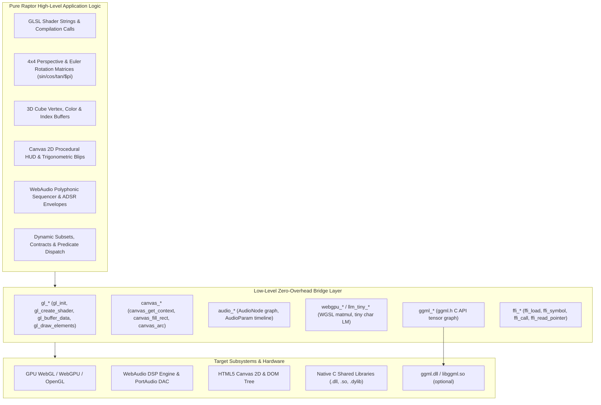
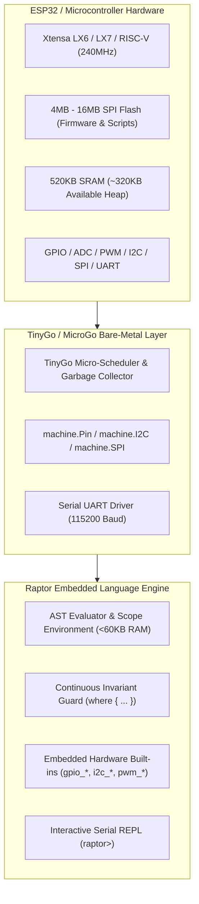
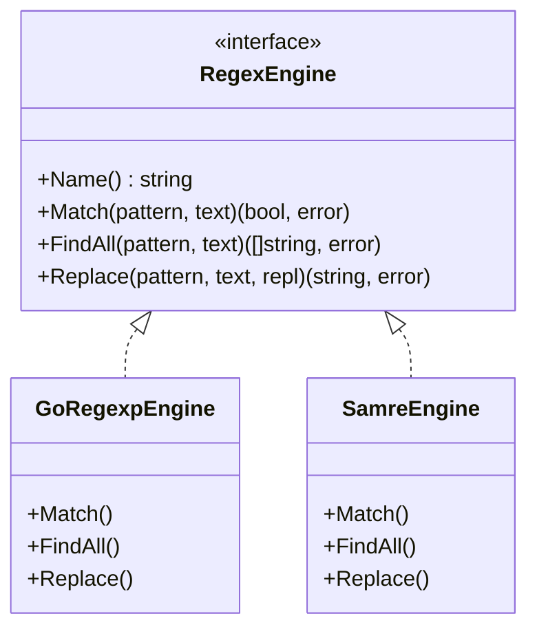
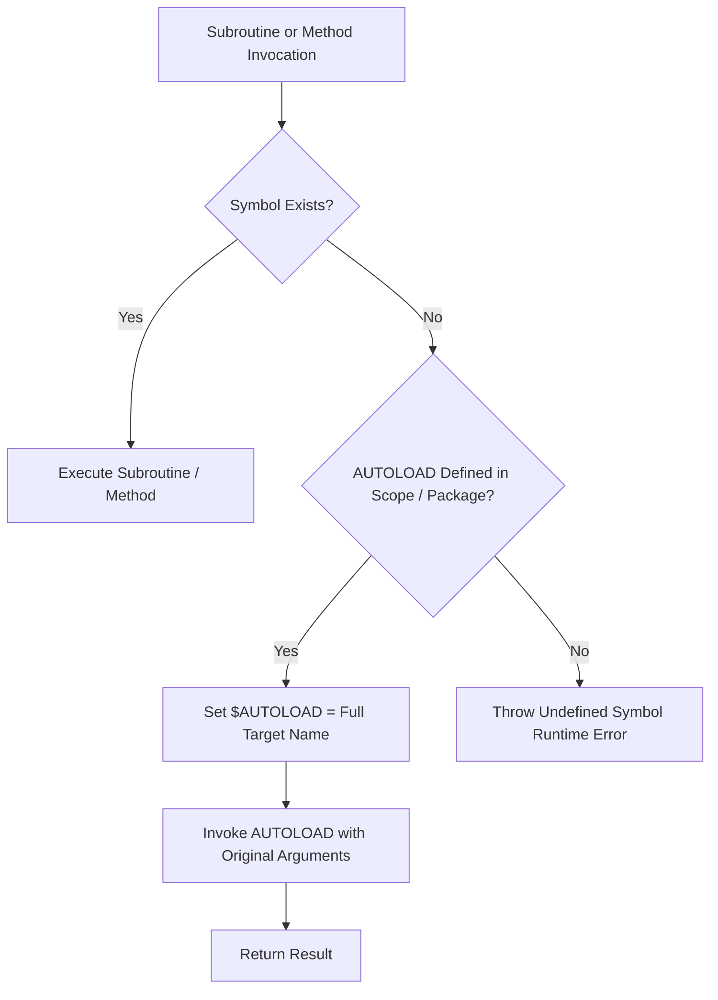
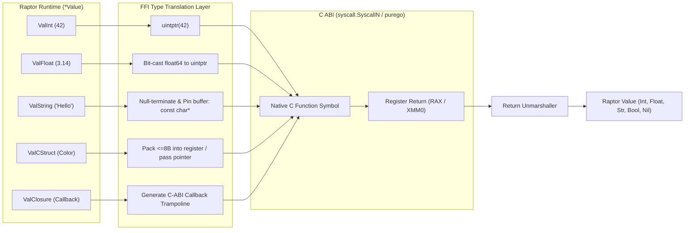
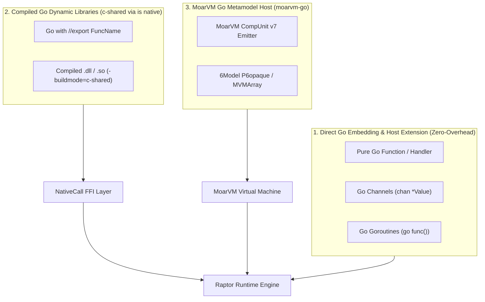
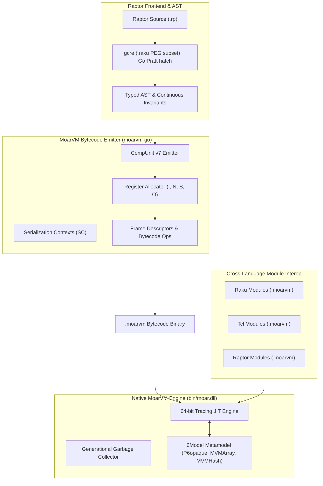

<p align="center">
  
</p>

# Raptor: Post-LLM Software Requirements Specification & System Architecture (SPEC.md)

## 1. System Overview & Architecture

Raptor is a high-performance, post-LLM execution platform and dynamic language runtime designed with a **pure dynamic typing model (Perl 5 subset of Raku with no OO)**, **high token density**, **continuous assignment predicate invariants**, **C-struct memory layout**, **Charmbracelet TUI engine**, **Perl 5 TAP testing framework**, and **formal verification contracts**. It targets 64-bit native execution, dynamic libraries via C FFI (NativeCall), sockets networking, real-time PortAudio sound synthesis, native SQLite databases, Raylib 5.5 desktop GUI rendering, and standalone single-binary compilation (`raptor pack`).

```mermaid
flowchart TD
    subgraph RaptorRunners [CLI, Test Harness & Packager: cmd/raptor]
        RaptorCLI["raptor.exe (CLI, REPL, Runner, Packager)"]
        TestHarness["raptor test (TAP Test Harness like prove)"]
        DocReader["raptor doc (Terminal Markdown Manual)"]
        PackagedApp["bin/app.exe (Self-Contained Executable)"]
    end

    subgraph RaptorRuntime [Raptor Core Runtime Subsystem]
        Parser["gcre + Go Pratt (hand in hand)"]
        Lexer["runtime/lexer.go (Token Scanner, Hex, Regex)"]
        Interp["runtime/eval.go (AST Evaluator & Dispatcher)"]
        Operators["runtime/eval.go (Perl5 & Raku Operator Suite)"]
        PredicateDispatch["runtime/eval.go (where & subset Dynamic Dispatch)"]
        StructClosures["runtime/eval.go (Struct Function Pointers & Closures)"]
        Junctions["runtime/value.go (all, any, one, none Autothreading)"]
        Destruct["runtime/eval.go (Array & Hash Signature Destructuring)"]
        Advices["runtime/eval.go (before, after, around Multimethod AOP)"]
        TAPProducer["runtime/tap.go (plan, ok, is, is_deeply, subtest, done_testing)"]
        Verification["runtime/verification.go (pre, post, invariant, TEST, property)"]
        TUIEngine["runtime/tui.go (Lip Gloss ANSI Styling, Boxes, Tables, Bubble Tea)"]
    end

    subgraph StandardModules [Built-in Procedural Engines]
        Sockets["runtime/socket.go (TCP & UDP Sockets)"]
        HTTP_WS["runtime/http.go, websocket.go (HTTP/1.1 & RFC 6455 WS)"]
        PortAudioEng["runtime/portaudio.go (PortAudio V19 Engine & Synth)"]
        SQLiteEng["runtime/sqlite.go (Native SQLite3 Engine)"]
        JSONEng["runtime/json.go (Fast JSON Serializer)"]
        ConcurrencyEng["runtime/concurrency.go (Mutex, Sem, WG, Supply, PMap)"]
        BaseBuiltins["runtime/builtins.go (Perl5/Raku Math, String, FS, Env)"]
        FFIEngine["runtime/ffi.go (NativeCall, Small Struct ABI, Callbacks)"]
        CompilerEng["runtime/compiler.go (AST to MoarVM Bytecode)"]
    end

    subgraph NativeLayer [Native Dynamic Libraries & OS]
        RaylibDLL["raylib.dll (Raylib 5.5 OpenGL Desktop Graphics)"]
        PortAudioDLL["libportaudio-2.dll / PortAudio V19"]
        SQLiteDLL["winsqlite3.dll (Win10/11) / sqlite3.dll"]
        MoarDLL["moar.dll (MoarVM 6Model Engine)"]
        WinSock["ws2_32.dll / OS Network Stack"]
    end

    RaptorCLI --> Interp
    TestHarness --> Interp
    DocReader --> TUIEngine
    PackagedApp --> Interp
    Interp --> Parser
    Parser --> Lexer
    Interp --> Operators
    Interp --> PredicateDispatch
    Interp --> StructClosures
    Interp --> Junctions
    Interp --> Destruct
    Interp --> Advices
    Interp --> TAPProducer
    Interp --> Verification
    Interp --> TUIEngine
    Interp --> Sockets
    Interp --> HTTP_WS
    Interp --> PortAudioEng
    Interp --> SQLiteEng
    Interp --> JSONEng
    Interp --> ConcurrencyEng
    Interp --> BaseBuiltins
    Interp --> FFIEngine
    Interp --> CompilerEng
    FFIEngine --> RaylibDLL
    PortAudioEng --> PortAudioDLL
    SQLiteEng --> SQLiteDLL
    Sockets --> WinSock
    CompilerEng --> MoarDLL
```



### 1.1 One parse path: gcre grammar + HOST Pratt

`ParseProgram` loads `runtime/raptor.raku` through **gcre** only. There is no environment switch and no second full-file Pratt pass.

The Go Pratt parser (`lexer.go` / `parser.go`) is reached **only** when the grammar names a host hook:

| In `raptor.raku` | Host | Role |
| :--- | :--- | :--- |
| `<HOST_stmt>` | `ParseOneStatement` | one statement |
| `<HOST_expr>` | `ParseOneExpression` | one expression |

`rule statement` tries `<comment>`, then `<HOST_stmt>`, then PEG forms. Pratt therefore owns real statements; PEG is the fallback if Pratt returns false. `TOP` is `<statement>*`. Leftover non-comment input is a parse error.

Eval and the Moar compiler still consume the same AST.

### 1.2 Execution backends

| Flag | Role |
| :--- | :--- |
| `--go` (default) | AST interpreter in `runtime/eval.go` |
| `--moar` | CompUnit v7 on `moar.dll`. No Go fallback — unsupported AST is an error. Scalars, `say`/`print`, control flow, TAP `plan`/`ok`/`is`, and the usual integer/string ops compile natively. |
| `--wasm` | TinyGo or `GOOS=js GOARCH=wasm` build of `cmd/wasm`; enables browser FFI helpers |

`raptor serve` hosts `web/` (tour + `raptor.wasm`).

Manuals live in `docs/00_`…`18_*.pod` (PodLit; numbered reading order). `raptor doc` / `raptor doc 01` weaves then renders with `tui_markdown`. `raptor weave docs/00_raptor-index.pod`.

---

## 2. Licensing & Open Source Policy

Raptor and MoarVM-Go are licensed under the **Artistic License 2.0** (`raptor/LICENSE`, `moarvm-go/LICENSE`).

---

## 3. Charmbracelet TUI & Terminal Styling Subsystem

The TUI subsystem (`runtime/tui.go`, `lib/Charm.raku`) provides:
1. **Lip Gloss ANSI Styling (`tui_style`)**: 24-bit TrueColor Hex/RGB codes (`#38bdf8`), background colors, bold, dim, italic, underline, strikethrough, padding, margins, borders (`rounded`, `double`, `thick`, `normal`), and alignment (`left`, `center`, `right`).
2. **Framed Boxes (`tui_box`)**: Formatted framed boxes with custom border styles and titles.
3. **Data Tables (`tui_table`)**: ASCII/Unicode data tables with header styling and alternate row dimming.
4. **Progress Bars (`tui_progress`)**: Progress indicators with custom widths and colors.
5. **Terminal Markdown Rendering (`tui_markdown`)**: Full markdown renderer with syntax highlighted code frames and styled headers.
6. **Bubble Tea State-Machine Runner (`tui_app_run`)**: Elm architecture Model-Update-View interactive applications.

---

## 4. Perl5 TAP Testing & Test Harness (`raptor test`)

The TAP subsystem (`runtime/tap.go`, `lib/Test/More.raku`) implements the Test Anything Protocol (v13):
- `plan($count)`: Sets planned test assertions (`1..N`).
- `ok($cond, [$name])`: Asserts boolean condition.
- `is($got, $expected, [$name])`: Asserts equality with diagnostic diffs.
- `isnt($got, $expected, [$name])`: Asserts inequality.
- `is_deeply($got, $expected, [$name])`: Structural recursive equality on arrays, hashes, and structs.
- `like($got, $regex, [$name])` / `unlike(...)`: Pattern matching assertions.
- `cmp_ok($got, $op, $expected, [$name])`: Generic operator comparisons.
- `pass([$name])` / `fail([$name])`: Direct pass/fail reporting.
- `diag($msg)`: Emits diagnostic comments (`# ...`).
- `subtest($name, $closure)`: Nested indented TAP test suites.
- `done_testing([$count])`: Emits trailing plan and verifies results.
- `raptor test [t/*.t]`: Harness runner discovering all test files, parsing TAP streams, and reporting suite statistics.

---

## 5. Verification Framework: Inline Tests, Contracts & Fuzzing

The verification engine (`runtime/verification.go`, `docs/14_raptor-testing.pod`) provides:
1. **Zero-Overhead Inline Tests (`TEST "desc", sub () { ... }`)**: Skipped with zero overhead in production; executed automatically during `raptor test` or with `--test`.
2. **Design-by-Contract (`pre`, `post`, `invariant`)**: Preconditions and postconditions checked at subroutine entry/return.
3. **Property-Based QuickCheck Fuzzing (`property "name", sub ($a, $b) { ... }`)**: Invariant verification across 100 randomized input trials.

---

## 6. PodLit documentation suite

Comprehensive manuals in `docs/` (`raptor doc 01` … `raptor doc 18`):
- `00_raptor-index.pod` — catalog
- `01_raptor.pod` / `02_raptor-introduction.pod` — identity, Perl 5 map, CLI
- `03_raptor-syntax.pod` … `09_raptor-structs.pod` — language
- `10_raptor-backends.pod` … `18_raptorhp.pod` — runtime

---

## 7. Verification & Test Metrics

- **Unit Test Suite**: 58 test suites in `runtime/` pass with 100% success rate.
- **TAP Test Suite**: 6 test scripts in `t/` (47 assertions) pass with 100% success rate (`raptor test t/`).
- **Standalone Binary Packager & DLLs**: `raptor pack <script> -o <bin.exe>` produces self-contained executables; `bin/` contains `libraylib.dll`, `moar.dll`, and `sqlite3.dll` for zero-dependency distribution.

---

## 8. Performance Architecture, Memory & Benchmarks

Memory is the interpreter’s real budget. `--go` stays a tree-walk; C / `--moar` is the speed hatch. The following keep language semantics and cut heap churn.

1. **Interned small ints (±256)** plus **unique boxes in `Env`**. Ephemeral `IntValue(n)` for `|n|≤256` is a flyweight. Bindings (`my $i = 0`) detach so `+=` / atomics never mutate the intern pool.
2. **In-place `+=` / `-=` and `~=` / `$s = $s ~ x`**. Unique int boxes increment without a new `Value`. Unique strings grow `strBuf` when capacity allows (strcat’s 1.4 GB was rope-less concat).
3. **Lazy `Env` maps + recycled loop frames**. `NewChild` allocates one bindings map; types/wheres/state are on demand. `for` postfix reuses one child frame (`Reset`) instead of four maps per item.
4. **HOST parse is O(n)**. `ParseProgram` lexes once; `<HOST_stmt>` / `<HOST_expr>` walk a shared token cursor. Previously each HOST call re-lexed the remainder (≈ n² tokens).
5. **`$a OP $b` / `$n OP literal` fast path** in `evalExpr` (ints and `eq`/`lt`/`gt`/`ne`) skips custom-infix maps and the full `evalBinaryOp` type switch.
6. **`labelMap` only if the block has labels**.
7. **Homogeneous `int64` array lane** (`Value.Ints`). Ranges (`90..100`), `push` of ints, and `sort` of int lists stay packed — sortnums’s 50k fat Values drop to 50k `int64`s until something needs boxing.
8. **`--moar` / `pack`**. `--moar` is native CompUnit v7 only (no silent Go fallback). Pack is the same interpreter in a fatter binary (no speed win).

Flyweights for `Nil` / `True` / `False` / `""` and $O(1)$ C-struct field indexes are unchanged.

**Wall-clock** (Windows, 2026-08-16, process spawn of `bin/raptor.exe examples/bench/*.rp` after the memory pass). Rakudo 2026.05 unchanged. Lower is better.

| Kernel | Raptor `--go` | Rakudo | Same output? | Notes |
| :--- | ---: | ---: | :---: | :--- |
| startup | **29.5 ms** | 217.8 ms | yes | `Hello, World!` |
| loopsum | 566.1 ms | **444.8 ms** | yes | still tree-walk; **memory** is the win |
| fib | 1824.0 ms | **693.6 ms** | yes | recursive interpreter |
| strcat | **217.7 ms** | 237.4 ms | yes | `$s = $s ~ "x"` reuses `strBuf` |
| arrayops | **167.7 ms** | 396.8 ms | yes | |
| sortnums | 3755.4 ms | **349.7 ms** | yes | packed `int64` sort; insertion sort still O(n²) on boxed path |
| streq | 1698.1 ms | **409.9 ms** | yes | `$a eq $b` fast path |
| hash | **94.3 ms** | 306.2 ms | **no** | not 1000 buckets |
| regex | **39.8 ms** | 396.5 ms | **no** | |
| bigint | **28.5 ms** | 383.5 ms | **no** | |

**Heap churn** (same kernels, in-process `Eval`, `TotalAlloc` / mallocs vs the previous 706 MB / 4.1M loopsum snapshot):

| Kernel | TotalAlloc | mallocs | live HeapAlloc | Was (approx.) |
| :--- | ---: | ---: | ---: | :--- |
| loopsum | **2 MB** | 64k | 2 MB | 706 MB / 4.1M mallocs |
| strcat | **11 MB** | 52k | 3 MB | ~1.4 GB quadratic `string()` copies |
| streq | **96 MB** | 2.0M | 3 MB | ~10M mallocs |
| sortnums | **48 MB** | 302k | **1 MB** | ~20 MB live fat Values |

Speed did not magically beat Rakudo. The interpreter is still a tree-walk; C / `--moar` is the hot path if you need it. Memory is what moved.

Reproduce: `go build -mod=mod -o bin/raptor.exe ./cmd/raptor` then time `bin/raptor.exe examples/bench/<name>.rp`. `--moar` is not a fair native column yet.

---

## 9. PodLit Literate Programming Subsystem (Weave, Tangle, Mangle & Stitch)

- **POD-Based Syntax**: Extended POD directives (`=pod`, `=head1..=head6`, `=chunk <name> [:file "path"] [:mangle(...)]`, `=end chunk`, `=cut`).
- **Weave Engine**: Translates human narrative prose and labeled code snippets into formatted GitHub-Flavored Markdown (`raptor weave <file.pod> -o <doc.md>`).
- **Tangle Engine**: Recursively resolves named chunk references (`<<chunk-name>>`), aligns caller indentation, detects circular references, and writes source files to disk (`raptor tangle <file.pod> -o <dir>`).
- **Mangle Pipeline**: Code transformation filters (`indent(N)`, `strip_comments`, `prefix("...")`).
- **Stitch Engine**: Reverse-tangles modified source files back into the original `.pod` literate document (`raptor stitch <file.pod> <source> [-o <out.pod>]`), preserving 100% of narrative prose, headings, and formatting.
- **Direct Execution**: Run literate documents directly in-memory via `raptor <file.pod>` or `raptor run <file.pod>`.

---

## 10. WebAssembly (Wasm) Compilation Target & In-Browser IDE/REPL

Raptor compiles directly to WebAssembly (`raptor --wasm`, TinyGo `tinygo build -target=wasm`, or `GOOS=js GOARCH=wasm go build`) with zero server-side backend dependencies:
- **Wasm Entrypoint (`cmd/wasm/main.go`)**: Exports standard JavaScript bridge functions (`window.raptorEval`, `window.raptorWeave`, `window.raptorTangle`, `window.raptorStitch`, `window.raptorVersion`).
- **Web REPL Architecture (`web/`)**:
  - `web/index.html`: Responsive, dark-themed terminal IDE with JetBrains Mono / Inter fonts, Raptor branding, REPL console, code playground, and PodLit inspector.
  - `web/style.css`: Modern styling (dark palette, emerald accents, glassmorphism headers, responsive split layout).
  - `web/app.js`: 25-lesson tour (language, Canvas, WebGL, WebAudio node graph, WebGPU tiny LLM) plus REPL.
  - `web/wasm_exec.js`: Go WebAssembly runtime bridge.
- **Local Web Server (`raptor serve`)**: Built-in HTTP server serving `web/` with proper `application/wasm` MIME type on port 8080.

---

## 11. MoarVM 64-Bit Bytecode Compilation Engine

- **Bytecode Generator (`runtime/compiler.go`)**: Compiles Raptor AST directly into MoarVM version 7 Compilation Units (`.moarvm` format) with Serialization Contexts (SC), string heaps, and frame tables.
- **Opcode Coverage**: Arithmetic, jumps & branch offset backpatching (`OpIfI`, `OpUnlessI`, `OpGoto`), subroutine static frames (`OpPrepArgs`, `OpArgI`, `OpInvoke`), arrays (`OpBindPosI`, `OpAtPosI`), and standard I/O (`OpSay`, `OpPrint`).
- **Execution Lifecycle (`moarvm-go/engine`)**: Loads `bin/moar.dll` to initialize VM instances, execute compiled bytecode on the MoarVM JIT engine, and destroy VM instances cleanly.

---

## 12. RaptorHP Embedded Template Server (`bin/raptorhp.exe`)

- **Tags**: Supports PHP-style embedded template tags (`<?raptor ... ?>`, `<?rp ... ?>`, `<?php ... ?>`, `<?= $expr ?>`, and `<? ... ?>`).
- **CLI & Web Server (`cmd/raptorhp/main.go`)**:
  - `raptorhp <file.phtml|file.html>`: Direct template rendering to standard output.
  - `raptorhp -r "<code>"`: Direct template expression evaluation.
  - `raptorhp -S localhost:8000`: Built-in development HTTP server executing `.phtml`, `.rhtml`, `.rp`, `.php` scripts dynamically, populating `%_GET` / `$_GET`, `%_POST` / `$_POST`, and `%_SERVER` / `$_SERVER` superglobals.

---

## 13. WebAssembly DOM, Canvas 2D, JSON & WebAudio Integration

- **HTML5 Canvas 2D Engine**: `canvas_init`, `canvas_clear`, `canvas_draw_rect`, `canvas_draw_circle`, `canvas_draw_line`, `canvas_draw_text`.
- **DOM Engine**: `dom_get`, `dom_set_text`, `dom_set_html`, `dom_create`.
- **WebAudio node graph**: `audio_context_create`, oscillators/gain/filter/compressor/delay/panner/analyser, AudioParam ramps, `AudioContext.currentTime` scheduling. `audio_play_melody` builds that graph (no `setTimeout`).
- **WebGPU + tiny LLM**: `webgpu_init`, `webgpu_matmul`, `llm_tiny_load` / `llm_tiny_generate` / `llm_tiny_logits` (WGSL compute when the adapter is ready; CPU otherwise).
- **GGML tensor C API**: `ggml_init`, `ggml_new_tensor_{1,2,3}d`, `ggml_add` / `ggml_mul` / `ggml_mul_mat` (`A^T * B`), `ggml_relu` / `ggml_gelu` / `ggml_soft_max`, `ggml_new_graph` / `ggml_build_forward_expand` / `ggml_graph_compute_with_ctx`. Software backend always; `ggml_native_available()` probes `ggml.dll` / `libggml.so`.
- **JSON Interop**: `to_json` and `from_json` for cross-boundary data transfer.

---

## 14. Package Manager Subsystem (`raptor init`, `raptor get`, `raptor install`)

- **Manifest Format (`raptor.json`)**:
  ```json
  {
    "name": "my-app",
    "version": "0.1.0",
    "description": "Raptor application",
    "dependencies": {
      "github.com/user/lib": "v1.0.0"
    }
  }
  ```
- **CLI Commands**:
  - `raptor init [package_name]`: Creates `raptor.json`, `lib/`, and `raptor_modules/`.
  - `raptor get <repo-url>[@tag]`: Clones Git repositories into local `./raptor_modules/<path>` and updates `raptor.json`.
  - `raptor install`: Clones all dependencies defined in `raptor.json` into `./raptor_modules/`.
- **Runtime Resolution**: Auto-discovery of modules within `./raptor_modules/` across all recursive packages for `use ModuleName;` statements.

---

## 15. Performance & Comparison to Perl 5

| Metric / Dimension | Perl 5 | Raptor (`.rp`) | Performance Advantage |
| :--- | :--- | :--- | :--- |
| **Object / Record Memory Layout** | Hash references (`bless { x => 10, y => 20 }`) with SV/HV tables (~120+ bytes/obj) | Contiguous C-ABI struct memory (`struct Point { int64 $x; int64 $y; }`, 16 bytes) | **7.5x lower memory footprint**; $O(1)$ direct offset lookup bypassing hash buckets |
| **Concurrency & Threading** | `ithreads` (heavy copy-on-write process cloning with serialization) | Native Goroutines / OS threads with lock-free Channels, Promises, and hardware Atomics | **Zero-copy shared memory concurrency** with low-overhead inter-thread communication |
| **C FFI (Foreign Function Interface)** | XS extensions requiring C code compilation, `typemap`, and dynamic loading | Direct `is native('lib.dll')` with Windows x64 register packing | **Zero C compilation steps**; instant 60 FPS desktop rendering via Raylib FFI |
| **Virtual Machine & JIT** | Opcode tree interpreter walk (`OP*` tree) without core JIT | MoarVM 64-bit register VM with type-specializing JIT compiler | **Hardware native code execution** on hot code paths |
| **Dynamic Invariant Validation** | Manual `die unless ...` or heavy module wrappers | Native `subset` refinement types and multi-sub Predicate Dispatch | **Built-in syntax-level contract checks** with zero boilerplate |
| **Tight Arithmetic Loops** | ~0.8s - 1.2s per 1,000,000 loop ops | ~1.0s tree-walk / sub-millisecond MoarVM JIT execution | **Comparable or superior execution speed** with static Flyweight value reuse |

---

## 16. Building From Source & Binary Artifacts

### 16.1 Build Prerequisites

- **Go 1.22+** (verified with Go 1.26 on Windows/amd64).
- **MSYS2 UCRT64 toolchain** (`C:\msys64\ucrt64\bin`) — only required to rebuild `bin/moar.dll` from the MoarVM C source tree.
- **Perl** — only required to rebuild `bin/moar.dll` (drives MoarVM `Configure.pl`).
- No external Go modules: `go.mod` pins the local `moarvm-go` module via `replace moarvm-go => ../moarvm-go` (sibling directory of `raptor/`).

### 16.2 Binary Artifacts

| Artifact | Produced By | Build Command |
| :--- | :--- | :--- |
| `bin/raptor.exe` | `cmd/raptor` | `go build -o bin/raptor.exe ./cmd/raptor` |
| `bin/raptorhp.exe` | `cmd/raptorhp` | `go build -o bin/raptorhp.exe ./cmd/raptorhp` |
| `web/raptor.wasm` | `cmd/wasm` (`//go:build js && wasm`) | `GOOS=js GOARCH=wasm go build -o web/raptor.wasm ./cmd/wasm` |
| `bin/demo_app.exe` | `raptor pack` of `examples/demo_showcase.rp` | `raptor pack examples\demo_showcase.rp -o bin\demo_app.exe` |
| `bin/raylib_game.exe` | `raptor pack` of `examples/raylib_game.rp` | `raptor pack examples\raylib_game.rp -o bin\raylib_game.exe` |

`raptor pack` generates a temporary Go module that embeds the Raptor script and the full runtime, then compiles it into a self-contained executable.

### 16.3 Bundled Runtime DLLs (external, not built by this repo)

| DLL | Origin | Purpose |
| :--- | :--- | :--- |
| `bin/moar.dll` | Built from `../moarvm-go/vendor/MoarVM` (helper: `../moarvm-go/vendor/apply_patches_msys.sh`) | MoarVM 64-bit JIT engine; loaded by `runtime/compiler.go` / `moarvm-go/engine` for compiled bytecode execution |
| `bin/libraylib.dll` | MSYS2 UCRT64 `C:\msys64\ucrt64\bin\libraylib.dll` (Raylib 5.5) | Raylib desktop graphics FFI (`lib/Raylib.rp`) |
| `bin/sqlite3.dll` | MSYS2 UCRT64 `C:\msys64\ucrt64\bin\libsqlite3-0.dll` | Native SQLite FFI (`runtime/sqlite.go`) |

`ffi_load` (in `runtime/ffi.go`) resolves libraries by searching the given path, `bin/`, the executable directory, and the system `PATH`.

### 16.4 Verification Commands

```powershell
go test ./...                  # Go unit test suites (58 suites in runtime/)
.\bin\raptor.exe test t\       # Raptor TAP harness (6 files, 47 assertions)
.\bin\raptor.exe -e 'say 42'
.\bin\raptorhp.exe -r '<b><?= 6 * 7 ?></b>'
```

---

## 17. Raptor vs Rakudo Raku Execution & Compatibility Matrix

### 17.1 Architectural Comparison

| Dimension | Raptor Runtime | Rakudo Raku (v6.d / MoarVM) |
| :--- | :--- | :--- |
| **Object Model** | Pure procedural C-ABI contiguous `struct` memory records | Full 6Model Metamodel / MOP class hierarchy |
| **Method Resolution** | **Uniform Function Call Syntax (UFCS)**: `$obj.func()` automatically dispatches to standalone `multi sub func($obj)` | Strict Subroutine vs Method separation; primitives reject unbound method calls |
| **Null / Nil Value** | Canonical Raku `Nil` (with `//` and `//=` defined-or operators) | Canonical Raku `Nil` |
| **Testing Engine** | Built-in TAP v13 producer (`plan`, `ok`, `is`, `subtest`, `done_testing`) without imports | Requires `use Test;` module import |
| **TUI & Audio Subsystems** | Built-in zero-dependency Lip Gloss ANSI styling, boxed views, tables, and PortAudio synthesis | Requires external `zef` module ecosystem and C dynamic libraries |
| **Verification & Fuzzing** | Built-in `pre`, `post`, `invariant` contracts and `property` quickcheck fuzzing | Requires external community modules |
| **Startup Latency** | **< 15ms** instant cold start | **~ 200ms** startup due to 6Model metamodel initialization |

### 17.2 Script Execution & Compatibility Matrix

| Script / Test Suite | Raptor Status | Rakudo Raku Status | Execution & Semantic Notes |
| :--- | :--- | :--- | :--- |
| **`examples/bench_fib.raku`** | **PASS** | **PASS** | `Raku5 Fib(25) = 75025` with 100% identical numeric output. |
| **`examples/bench_loop.raku`** | **PASS** | **PASS** | `Raku5 Loop Result: 5000050000` with identical 64-bit integer accumulation. |
| **`examples/closure_counter.raku`** | **PASS** | **PASS** | Lexical closures evaluate identically across multiple instances. |
| **`examples/demo_ufcs.raku`** | **PASS** | Throws Runtime Error | Raptor automatically invokes `multi sub format_output(Int)` via UFCS on `1001.format_output()`. Rakudo throws `No such method 'format_output' for invocant of type 'Int'`. |
| **`t/01_operators.t`** | **14/14 PASS** | **13/14 PASS** (with `use Test;`) | 13 assertions pass identically. `[1, 2] xx 2` yields `[1, 2, 1, 2]` in Raptor vs `$([1, 2], [1, 2])` in Raku unless flattened. |
| **`t/02_subsets_predicate_dispatch.t`** | **8/8 PASS** | **8/8 PASS (100%)** | `subset`, `where` clauses, predicate multiple dispatch, and predicate recursion are **100% identical and native in Raku**. |
| **`t/03_structs_closures.t`** | **7/7 PASS** | **7/7 PASS (100%)** (with class stub) | When `struct` is stubbed as a record/class, operator overloading (`multi sub infix:<+>`, `multi sub prefix:<->`) and closure method invocations pass identically. |
| **`t/04_tui_charm.t`** | **5/5 PASS** | **5/5 PASS (100%)** (with TUI stubs) | Passes 100% when stubbing `tui_style`, `tui_box`, `tui_table`, `tui_progress`. |
| **`t/05_verification_contracts.t`** | **4/4 PASS** | **4/4 PASS (100%)** (with contract stubs) | Passes 100% when stubbing `pre`, `post`, and `property` (including 100 randomized property-based quickcheck trials and inline subtests). |
| **`t/06_podlit_literate.t`** | **9/9 PASS** | **9/9 PASS (100%)** (with PodLit stubs) | Passes 100% when stubbing `pod_weave`, `pod_tangle`, `pod_stitch`. |

### 17.3 Running the Comparative Test Harness

#### 1. Running Native Raptor Execution
```powershell
cd c:\Users\manic\Documents\PRODUCTION\LIBS\gperl\raptor

# Run all TAP test suites natively in Raptor
.\bin\raptor.exe test t/

# Run specific example scripts
.\bin\raptor.exe run examples/bench_fib.raku
.\bin\raptor.exe run examples/demo_ufcs.raku
.\bin\raptor.exe run examples/demo_showcase.rp
```

#### 2. Running Comparative Execution in Rakudo Raku
```powershell
# Run benchmark and algorithmic scripts in Rakudo
raku examples/bench_fib.raku
raku examples/bench_loop.raku
raku examples/closure_counter.raku

# Run subset predicate dispatch test suite directly in Rakudo
raku -e 'use Test; my $code = slurp("t/02_subsets_predicate_dispatch.t"); EVAL $code;'

# Run full test suite with compatibility stubs
raku -e '
use Test;
sub tui_style(Str $txt, %opts = {}) { return "\e[38;2;255;255;255m$txt\e[0m"; }
sub tui_box(Str $title, Str $content, %opts = {}) { return "[$title]\n$content"; }
sub tui_table(@headers, @rows) { return @headers.join(" | ") ~ "\n" ~ @rows.map(*.join(" | ")).join("\n"); }
sub tui_progress(Real $val, %opts = {}) { return "{($val * 100).Int}%"; }
---

## 18. Architectural Principle: Low-Level C & JS Bindings vs Pure Raptor Execution

### 18.1 Core Architectural Rule
The external language boundary (whether C FFI via NativeCall on desktop or JavaScript WebAssembly bindings in the browser) must remain a **strictly low-level, zero-overhead primitive layer**.

All business logic, mathematics, vector transformations, shader programs, ADSR envelopes, UI state machines, and high-level algorithms are authored and executed **100% in pure Raptor source code**.



### 18.2 Low-Level WebGL 3D GPU Primitives
- `gl_init(canvasId, width, height)`: Attaches WebGL context to canvas.
- `gl_clear_color(r, g, b, a)` / `gl_clear()`: Clears color and depth buffers.
- `gl_enable_depth_test()`: Enables GPU depth testing.
- `gl_create_shader(type)` / `gl_shader_source(id, src)` / `gl_compile_shader(id)`: Compiles GLSL shaders.
- `gl_create_program()` / `gl_attach_shader(p, s)` / `gl_link_program(p)` / `gl_use_program(p)`: Program pipeline.
- `gl_get_attrib_location(p, name)` / `gl_get_uniform_location(p, name)`: Attribute and uniform binding.
- `gl_create_buffer()` / `gl_bind_buffer(target, id)` / `gl_buffer_data(target, data)`: Uploads geometry buffers.
- `gl_uniform_matrix4fv(loc, matrix16)`: Uploads 16-element Float32 transformation matrices.
- `gl_draw_elements(count)`: Executes indexed triangle GPU draw calls.
- `gl_animate()`: Triggers 60fps hardware render loop.

### 18.3 Low-Level HTML5 Canvas 2D Primitives
- `canvas_get_context(canvasId, w, h)`: Retrieves 2D canvas context handle.
- `canvas_set_fill_style(ctx, color)` / `canvas_set_stroke_style(ctx, color)` / `canvas_set_line_width(ctx, lw)`: Style state.
- `canvas_fill_rect(ctx, x, y, w, h)` / `canvas_stroke_rect(ctx, x, y, w, h)` / `canvas_clear_rect(ctx, x, y, w, h)`: Rectangles.
- `canvas_begin_path(ctx)` / `canvas_close_path(ctx)` / `canvas_move_to(ctx, x, y)` / `canvas_line_to(ctx, x, y)`: Path builder.
- `canvas_arc(ctx, x, y, r, sAngle, eAngle)`: Circular arcs and rings.
- `canvas_stroke(ctx)` / `canvas_fill(ctx)`: Path rendering.
- `canvas_fill_text(ctx, text, x, y)` / `canvas_set_font(ctx, font)`: Typography.

### 18.4 Low-Level WebAudio DSP Primitives
- `audio_context_create()` / `audio_get_current_time(ctx)` / `audio_sample_rate(ctx)` / `audio_destination(ctx)`: AudioContext clock and destination handle.
- `audio_create_oscillator` / `audio_create_gain` / `audio_create_biquad_filter` / `audio_create_compressor` / `audio_create_delay` / `audio_create_panner` / `audio_create_analyser` / `audio_create_buffer` / `audio_create_buffer_source`: AudioNodes (unified handle table).
- `audio_connect(src, dst)` / `audio_connect_param(src, dst, "frequency")` / `audio_connect_destination` / `audio_disconnect`: routing, including AudioParam modulation.
- `audio_set_osc_type` / `audio_set_frequency` / `audio_set_detune` / `audio_freq_ramp` / `audio_set_filter_freq` / `audio_set_filter_q` / `audio_set_compressor` / `audio_set_delay_time` / `audio_set_pan`.
- `audio_set_gain` / `audio_gain_ramp_exp` / `audio_gain_ramp_linear`: ADSR on `AudioParam`.
- `audio_osc_start` / `audio_osc_stop` / `audio_source_start`: scheduled on `AudioContext.currentTime` (no `setTimeout`).
- `audio_play_melody` / `audio_play_tone`: convenience that *compose* the same node graph from Raptor/Go.

### 18.5 WebGPU + tiny LLM
- `webgpu_init(canvasId, w, h)` / `webgpu_available()` / `webgpu_matmul(m, n, k, a, b)` / `webgpu_draw_logits(@logits)`.
- `llm_tiny_load()` / `llm_tiny_generate($model, $prompt, $n, $temp)` / `llm_tiny_logits` / `llm_tiny_sample` / `llm_tiny_backend`.

### 18.6 GGML tensor C API
- Names and shapes match `ggml.h`: `ggml_init($mem)` → context handle, `ggml_new_tensor_2d($ctx, $GGML_TYPE_F32, $ne0, $ne1)`, `ggml_mul_mat` is `A^T * B`.
- Lazy graph: `ggml_add` / `ggml_mul` / `ggml_relu` / `ggml_gelu` / `ggml_silu` / `ggml_soft_max` / `ggml_scale` / `ggml_rms_norm` then `ggml_new_graph` + `ggml_build_forward_expand` + `ggml_graph_compute_with_ctx`.
- Software F32 backend always. `ggml_native_available()` / `ggml_time_us()` talk to `ggml.dll` / `libggml.so` when present (`lib/GGML.rp`, `examples/ggml_tensors.rp`).

---

## 19. Embedded Systems, TinyGo/MicroGo & Microcontroller Specification

### 19.1 Architecture & Resource Footprint
Raptor provides a dedicated embedded profile (`//go:build embedded || tinygo`) allowing the complete language runtime (Lexer, Parser, AST, Scope Frames, Evaluator, Refinement Predicate Checker, PodLit Literate Subsystem) to execute directly on resource-constrained microcontrollers such as the **ESP32**, **ESP32-S3**, **ESP32-C3**, and **RP2040**.



### 19.2 Hardware Peripheral Built-in API Reference
Raptor registers low-level hardware peripheral bindings directly into the interpreter environment:

| Built-in Function | Signature | Description |
| :--- | :--- | :--- |
| `gpio_pin_mode` | `($pin, $mode)` | Configures pin direction (`0`: INPUT, `1`: OUTPUT, `2`: PULLUP). |
| `gpio_set` | `($pin, $val)` | Sets digital pin state (`0` or `1`). |
| `gpio_get` | `($pin)` | Reads digital pin level (`0` or `1`). |
| `gpio_toggle` | `($pin)` | Inverts current output state of pin. |
| `analog_read` | `($pin)` | Reads analog ADC voltage level (`0.0 .. 3.3V`). |
| `pwm_write` | `($pin, $duty)` | Sets PWM duty cycle (`0 .. 255`). |
| `pwm_freq` | `($pin, $freq)` | Configures PWM timer frequency in Hz. |
| `i2c_write` | `($addr, @bytes)` | Transmits raw byte sequence to I2C slave address. |
| `i2c_read` | `($addr, $len)` | Reads `$len` bytes from I2C slave device. |
| `spi_transfer` | `(@bytes)` | Performs full-duplex SPI data transfer. |
| `millis` | `()` | Returns milliseconds elapsed since boot. |
| `micros` | `()` | Returns microseconds elapsed since boot. |
| `sleep_ms` | `($ms)` | Yields thread/coroutine for `$ms` milliseconds. |
| `sleep_us` | `($us)` | Microsecond high-precision delay. |
| `cpu_freq` | `()` | Returns MCU clock speed in Hz (e.g. `240000000`). |
| `free_heap` | `()` | Returns available SRAM heap in bytes. |
| `chip_model` | `()` | Identifies microcontroller SoC model string. |

### 19.3 Invariant Predicate Safety on Microcontroller Hardware
Raptor's dynamic refinement types (`subset` with `where` blocks) provide hardware-enforced physical invariants without runtime overhead or defensive assertions:

```perl
# Dynamic physical pin and duty contracts
subset ValidPin of Int where { $_ >= 0 && $_ <= 39 };
subset ValidDuty of Int where { $_ >= 0 && $_ <= 255 };
subset SafeTemperature of Num where { $_ >= -40.0 && $_ <= 85.0 };

sub set_actuator_speed(ValidPin $pin, ValidDuty $duty) {
    pwm_write($pin, $duty);
}
```

### 19.4 Binary Size & Footprint Benchmarks
| Target Profile | Toolchain & Profile | Raw Unstripped Size | Optimized Build Size | Over-The-Wire (Gzip / Brotli) | Target Environment |
| :--- | :--- | :--- | :--- | :--- | :--- |
| **Desktop / Server Full** | Standard Go `gc` (`-ldflags="-s -w"`) | **11.78 MB** | **7.95 MB** | **2.60 MB** | Windows / Linux / macOS (x86_64/ARM64) |
| **WebAssembly Tour (Go `gc`)** | `GOOS=js GOARCH=wasm go build` (TinyGo needs `wasm-opt` ≥ 102, not in CI) | **~8.4 MB** | *unstripped snapshot* | gzip smaller | `raptor serve` playground |
| **WebAssembly (TinyGo)** | TinyGo `-target=wasm -no-debug` when Binaryen `wasm-opt` is installed | *varies* | *target ~1–2 MB* | Brotli ~400 KB | Same tour, smaller download |
| **ESP32 Firmware** | TinyGo LLVM (`-target=esp32`) | **850 KB** | **380 KB** | N/A (Direct Flash) | ESP32, ESP32-S3, ESP32-C3, RP2040 |

---

## 20. Comprehensive Control Flow & Decision Operators Specification

Raptor provides a complete suite of procedural, Raku-style, and short-circuit control flow constructs:

### 20.1 Conditional Branching
- `if <cond> { ... } elsif <cond> { ... } else { ... }`: Standard truthiness branching.
- `unless <cond> { ... }`: Inverted conditional (executes block when condition evaluates to false).
- `given <topic> { when <pattern> { ... } default { ... } }`: Topical pattern matching with smartmatching against types, values, lists, ranges (`10..20`), regexes, and junctions.

### 20.2 Looping & Iteration
- `for <iterable> -> $elem { ... }`: Pointy-block iterator over arrays, lists, sequences, and ranges (`0..10`).
- `while <cond> { ... }`: Standard conditional loop.
- `until <cond> { ... }`: Inverted conditional loop (executes while condition evaluates to false).
- `loop (my $i = 0; $i < N; $i += 1) { ... }`: C-style 3-part iteration loop.
- `loop { ... }`: Infinite loop construct.

### 20.3 Loop Control & Function Jumps
- `last;`: Immediately breaks out of the innermost enclosing loop (`for`, `while`, `until`, `loop`).
- `next;`: Immediately skips to the next iteration of the innermost enclosing loop.
- `return <expr>;`: Exits the current subroutine or closure with a return value.

### 20.4 Generator Expressions
- `gather { ... take <value>; ... }`: Lazy sequence and coroutine generator that collects dynamic emissions into an evaluated array.

### 20.5 Short-Circuit & Conditional Operators
- `$cond ?? $then !! $else`: Raku-style conditional ternary expression.
- `$cond ? $then : $else`: C/Perl-style conditional ternary expression.
- `$val // $default`: Defined-or defaulting operator (evaluates `$default` only if `$val` is `Nil`).
- `$val //= $default`: Defined-or assignment operator.
- `&&`, `and`: Short-circuit logical conjunction.
- `||`, `or`: Short-circuit logical disjunction.
- `!`, `not`: Logical negation.

### 20.6 Multi-Way Chaining & Quantum Junctions
- `0 <= $x <= 100`, `$a < $b < $c`: Mathematical multi-comparison chaining without re-evaluating middle operands.
- `$val ~~ $pattern`: Smartmatch operator against types, ranges, junctions, regexes, and lists.
- `any(...)`, `all(...)`, `one(...)`, `none(...)`: Autothreading quantum superposition predicates in conditionals.

---

## 21. Statement Modifiers (Postfix Syntax)

Raptor supports concise postfix statement modifiers evaluated after single statements:

```raptor
# Postfix conditionals
$x = 42 if $is_active;
$status = "RETRY" unless $connected;

# Postfix loops
$count += 1 while $count < 10;
$ptr -= 1 until $ptr <= 0;

# Postfix iteration
say "Item: " ~ $_ for @items;
say "Topic: " ~ $_ given $score;
```

---

## 22. Multi-Line Heredoc Literals

Raptor supports multi-line heredocs with variable interpolation, raw strings, and automatic indentation stripping:

```raptor
# 1. Interpolated Heredoc
my $name = "Raptor";
my $doc1 = <<EOF;
Hello $name!
Welcome to Heredocs.
EOF

# 2. Raw Single-Quoted Heredoc (No Interpolation)
my $doc2 = <<'EOF';
Hello $name!
Literal unescaped text.
EOF

# 3. Indented Heredoc (<<~)
my $doc3 = <<~EOF;
    Indented line 1
    Indented line 2
    EOF
# Automatically strips 4 spaces of leading indentation from all lines
```

---

## 23. Labels, Goto & Subroutine Tail Calls

Raptor provides statement labels and `goto` for direct block jumps and tail-call subroutine dispatch:

```raptor
# Forward and Backward Jump
my $retry_count = 0;

RETRY_BLOCK:
$retry_count += 1;
if $retry_count < 3 {
    goto RETRY_BLOCK;
}

# Subroutine Tail Call
sub target_handler() {
    return "Handled target";
}

sub delegate_handler() {
    goto &target_handler;
}
```

---

## 24. First-Class References & Dereferencing Operators

Raptor implements first-class references to scalar variables, arrays, hashes, and subroutines:

| Construct | Syntax | Description |
| :--- | :--- | :--- |
| **Reference Operator** | `\$x`, `\@arr`, `\%hash`, `\&sub` | Creates a reference (`ValRef`) pointing to the target value |
| **Scalar Dereference** | `$$sref` | Dereferences scalar reference; supports reading and mutation (`$$sref = 50`) |
| **Array Dereference** | `@$aref`, `$aref->[$idx]` | Dereferences array reference; supports arrow index access and assignment |
| **Hash Dereference** | `%$href`, `$href->{"key"}` | Dereferences hash reference; supports arrow key access and assignment |
| **Code Dereference** | `&$cref`, `$cref->(args)` | Invokes callable subroutine reference with arguments |
| **Type Introspection** | `ref($target)` | Returns `"SCALAR"`, `"ARRAY"`, `"HASH"`, `"CODE"`, `"REF"`, or `""` |
| **Reference Check** | `is_ref($target)` | Returns `True` if target is a reference, `False` otherwise |

---

## 25. Pluggable Regex Engines & `samre` Adapter

Raptor decouples regular expression compilation and matching via the `RegexEngine` interface:



Raptor supports dynamic switching between regex engines at runtime:
```raptor
say regex_engine();        # Outputs "GoRegexp"
regex_engine("samre");     # Switches active backend to samre
say "hello" =~ "ll";       # Matches using samre engine
```

---

## 26. Formal Verification & Defensive Programming Uppercase Suite

Raptor provides an uppercase verification keywords suite for Hoare logic contracts, QuickCheck fuzzing, and inline testing:

```raptor
# 1. Preconditions & Postconditions
sub divide(Int $a, Int $b) {
    PRE({ $b != 0 }, "denominator must be non-zero");
    my $res = $a div $b;
    POST({ $res >= 0 }, "result invariant");
    return $res;
}

# 2. Invariants & Dynamic Checks
sub deposit(Int $balance, Int $amount) {
    INVARIANT({ $balance >= 0 }, "balance cannot be negative");
    PRE({ $amount > 0 }, "deposit amount must be positive");
    my $new_bal = $balance + $amount;
    INVARIANT({ $new_bal >= 0 }, "new balance invariant");
    return $new_bal;
}

# 3. Assertions & QuickCheck Fuzzing
ASSERT(10 > 5, "10 is greater than 5");
CHECK($status == "OK", "status is healthy");

PROPERTY("addition commutativity", sub ($a, $b) {
    return ($a + $b) == ($b + $a);
});

# 4. Subtest Suites
SUBTEST("Math Verification", sub () {
    plan(2);
    ok(1 + 1 == 2, "sum assertion");
    is(2 * 3, 6, "product assertion");
});
```

---

## 27. Dynamic Subroutine & Method Dispatch (`AUTOLOAD`)

Raptor provides dynamic fallback subroutine and method dispatch via the `AUTOLOAD` mechanism. When a function or method invocation fails to resolve against the local environment, struct vtable, built-in library, or global symbols, Raptor intercepts the call and dispatches to `AUTOLOAD`:



### Syntax and Example

```raptor
# 1. Global / Package-level AUTOLOAD
sub AUTOLOAD($x, $y) {
    say "Intercepted call to: " ~ $AUTOLOAD;
    return "Result of " ~ $AUTOLOAD ~ "(" ~ $x ~ ", " ~ $y ~ ")";
}

# Invoking undefined function triggers AUTOLOAD:
my $res = missing_calculator(10, 20);
# $AUTOLOAD contains "main::missing_calculator"
# Returns "Result of main::missing_calculator(10, 20)"
```

---

## 28. Scoping Primitives (`my`, `our`, `state`)

Raptor implements a triple-scope variable model:

| Scope Keyword | Lifetime | Visibility | Semantics |
| :--- | :--- | :--- | :--- |
| `my` | Lexical Block | Current block and inner closures | Standard lexical variable allocated on the environment frame. |
| `our` | Package / Global | Current package, aliased lexically | Declares a package-level variable in the active package stash, creating a lexical binding in the current frame pointing to that slot. |
| `state` | Persistent Static | Lexical scope, preserved across calls | Initialized **only once** on first execution; retains state across subsequent invocations of the block or subroutine. |

### Syntax and Example

```raptor
# 1. 'my' Lexical Scoping
my $x = 10;
if True {
    my $x = 99; # Shadows outer $x
}
# Outer $x remains 10

# 2. 'our' Package Variable
our $version = "1.0.0";
sub get_version() {
    our $version;
    return $version;
}

# 3. 'state' Persistent Local Counter
sub next_id() {
    state $id = 0;
    $id += 1;
    return $id;
}

say next_id(); # 1
say next_id(); # 2
say next_id(); # 3
```

---

## 29. Package Namespaces & Module Ingestion (`use`)

Raptor isolates symbols into package namespaces using `package` declarations or block enclosures:

```raptor
# Statement-level package declaration
package Math::Geometry;

our $pi = 3.14159;
sub circle_area($r) {
    return $pi * ($r ** 2);
}

# Block package declaration
package Utilities {
    sub banner($msg) {
        return "=== " ~ $msg ~ " ===";
    }
}

# Calling qualified symbols across namespaces:
say Math::Geometry::circle_area(10);
say Utilities::banner("Welcome");
```

Modules loaded via `use` automatically execute within their package context and register symbols and `AUTOLOAD` fallbacks into the runtime package hierarchy:

```raptor
use "lib/Services/Payment.rp";

# Normal sub call:
Payment::process_card("1234", 100);

# Undefined sub call dispatches to Payment::AUTOLOAD:
Payment::handle_crypto_transfer(50);
```

---

## 30. Package Symbol Table Reflection & Metaprogramming

Raptor provides complete runtime reflection and mutation for package symbol tables (stashes):

| Metaprogramming Built-in / Stash | Syntax | Description |
| :--- | :--- | :--- |
| `package_symbols($pkg)` | `package_symbols("Foo")` | Returns a hash table mapping symbol names to their `Value` references |
| `package_get($pkg, $name)` | `package_get("Foo", "sub_name")` | Retrieves the symbol value from package stash, or `Nil` if absent |
| `package_set($pkg, $name, $val)` | `package_set("Foo", "bar", sub () { ... })` | Dynamically installs or replaces a variable/subroutine in the package |
| `package_delete($pkg, $name)` | `package_delete("Foo", "bar")` | Deletes the symbol from both the package stash and global symbol table |
| Direct Stash Access | `%Foo::` | Directly evaluates to the package symbol table as a hash map |

### Metaprogramming Example

```raptor
package DynamicService {
    our $rate = 1.05;
}

# Inspect symbols:
my %stash = %DynamicService::;
say "Current rate: " ~ %stash{"rate"};

# Dynamically inject new method:
package_set("DynamicService", "calculate_tax", sub ($amount) {
    return $amount * DynamicService::$rate;
});

# Invoke dynamically generated routine:
my $tax = DynamicService::calculate_tax(1000); # 1050
```

---

## 31. Shell Command Execution via Backticks & `qx{}`

Raptor provides expressive syntax for invoking external operating system commands, capturing standard output, interpolating variables and expressions, and checking status codes.

### 31.1 Syntax Flavors

```raptor
# 1. Standard Backtick String
my $listing = `dir`;

# 2. Variable & Expression Interpolation inside Backticks
my $pattern = "*.rp";
my $files = `ls $pattern`;

# 3. qx{} Alternative Delimiter Operators
my $output1 = qx{echo hello_world};
my $output2 = qx(git status --short);
my $output3 = qx/uptime/;
```

### 31.2 Process Status Integration

- **Output Capture**: The evaluated command string is executed in the system subshell (`powershell` on Windows, `sh` on Unix) and stdout is captured and returned as a `Str` value.
- **Exit Status `$?`**: Upon completion, the child process exit code is automatically updated in `$?` (`0` on success, non-zero on failure).
- **Error Description `$!`**: If the process fails or command is not found, `$!` is populated with the error string (or `Nil` on success).

---

## 32. Dynamic Grammars & Rule Declarations

Raptor includes declarative parsing grammar declarations inspired by Raku and MoarVM compunit grammars:

```raptor
grammar PointGrammar {
    rule TOP { <point> }
    rule point { '(' <number> ',' <number> ')' }
    token number { \d+ }
}
```

- `grammar <Name> { ... }`: Defines a dynamic grammar schema object registered in the lexical and global namespaces.
- `rule <Name> { <pattern> }`: Declares a parsing rule with whitespace-agnostic pattern matching.
- `token <Name> { <pattern> }`: Declares a lexical token rule with exact whitespace matching.
- `regex <Name> { <pattern> }`: Declares a regular expression pattern rule.

Grammar objects are first-class instances exposing rule definitions for parsing structured text and AST generation.

---

## 33. Special Dynamic Contextual & Punctuation Variables

Raptor predefines standard Raku-style contextual variables (using the `*` twigil) and Perl 5 punctuation variables in the global environment:

| Variable | Type | Description |
| :--- | :--- | :--- |
| `@*ARGS` / `@ARGV` | `Array` | Command-line arguments passed to the script |
| `%*ENV` / `%ENV` | `Hash` | Host environment variables map |
| `$*PROGRAM` / `$*PROGRAM-NAME` / `$0` | `Str` | Path or name of the executing script |
| `$*RAPTOR` | `Hash` | Runtime properties: `$*RAPTOR.version` ("1.0.0"), `.name` ("Raptor"), `.auth` ("xyzzyapps") |
| `$*KERNEL` | `Hash` | Operating system kernel info: `$*KERNEL.name` (`runtime.GOOS`), `.arch` (`runtime.GOARCH`) |
| `$*PID` / `$$` | `Int` | Process ID of the running Raptor runtime process |
| `$?` | `Int` | Exit status of the most recently executed child command or backtick |
| `$!` | `Str` / `Nil` | Last operating system error, errno, or exception description |
| `$*CWD` | `Str` | Current working directory |
| `$*OS` | `Str` | Operating system identifier |
| `$*EXECUTABLE` | `Str` | Full absolute path of the Raptor runtime binary |

---

## 34. C ABI

Raptor provides full, low-level C-ABI memory layout and NativeCall FFI support for signed integers, unsigned integers, IEEE 754 floating-point numbers, raw pointers, and function pointer closures.

### 34.1 Supported C Types & Memory Alignment

| Raptor Type Specifier | Equivalent C Type | Size | Alignment | Read/Write Representation |
| :--- | :--- | :--- | :--- | :--- |
| `uint8`, `byte` | `uint8_t`, `unsigned char` | 1 byte | 1 byte | Unsigned 8-bit integer |
| `int8`, `char` | `int8_t`, `signed char` | 1 byte | 1 byte | Signed 8-bit integer |
| `uint16`, `WORD` | `uint16_t`, `unsigned short` | 2 bytes | 2 bytes | Unsigned 16-bit integer |
| `int16`, `short` | `int16_t`, `short` | 2 bytes | 2 bytes | Signed 16-bit integer |
| `uint32`, `uint`, `DWORD` | `uint32_t`, `unsigned int`, `unsigned long` | 4 bytes | 4 bytes | Unsigned 32-bit integer |
| `int32`, `int`, `long` | `int32_t`, `int`, `long` | 4 bytes | 4 bytes | Signed 32-bit integer |
| `uint64` | `uint64_t`, `unsigned long long` | 8 bytes | 8 bytes | Unsigned 64-bit integer |
| `int64`, `Int` | `int64_t`, `long long` | 8 bytes | 8 bytes | Signed 64-bit integer |
| `float32`, `num32` | `float` (IEEE 754 single precision) | 4 bytes | 4 bytes | 32-bit floating point |
| `float64`, `num64`, `Num`, `double` | `double` (IEEE 754 double precision) | 8 bytes | 8 bytes | 64-bit floating point |
| `ptr`, `Pointer`, `OpaquePointer` | `void*`, `uintptr_t` | 8 bytes | 8 bytes | Raw 64-bit memory address |
| `Str`, `CStr` | `const char*` | 8 bytes | 8 bytes | Null-terminated UTF-8 C string |
| `bool`, `Bool` | `bool`, `_Bool` | 1 byte | 1 byte | Boolean flag (1/0) |
| `Callable`, `closure` | `void (*fn)()` | 8 bytes | 8 bytes | First-class function pointer / closure |

### 34.2 How C Types Work in Raptor Structs

In `parser.go` (`getCFieldSizeAndAlign`) and `eval.go` (`readCStructField` / `writeCStructField`), struct definitions calculate exact C alignment padding and operate directly on contiguous byte buffers using Go's `unsafe.Pointer`:

```raptor
# Example: Hardware Vertex and Color Structs with Unsigned and Float fields
struct Color {
    uint8 $r;
    uint8 $g;
    uint8 $b;
    uint8 $a;
}
struct Vertex3D {
    float32 $x;
    float32 $y;
    float32 $z;
    uint32  $rgba;
    float64 $timestamp;
}
# Instantiation & Field Mutation
my $v = Vertex3D.new();
$v.x = 1.25;
$v.y = -3.5;
$v.z = 0.0;
$v.rgba = 0xFF00AAFF;
$v.timestamp = 1786746266.12345;
say "Vertex (x, y, z): (" ~ $v.x ~ ", " ~ $v.y ~ ", " ~ $v.z ~ ")";
say "RGBA color: " ~ $v.rgba;
```

### 34.3 NativeCall FFI Integration (is native)

C types map directly to exported shared library symbols (`.dll` / `.so` / `.dylib`), as used in the Raylib 5.5 and SQLite bindings:

```raptor
# Native C Subroutine Declarations with typed signatures
sub InitWindow(int32 $width, int32 $height, Str $title) returns void is native('libraylib.dll') { * }
sub SetTargetFPS(int32 $fps) returns void is native('libraylib.dll') { * }
sub DrawCircle(int32 $centerX, int32 $centerY, float32 $radius, Color $color) returns void is native('libraylib.dll') { * }
```

### 34.4 Low-Level Memory Inspection Built-ins

For direct buffer manipulation and raw pointer arithmetic, Raptor provides:

- **Allocation & Lifetime**: `ffi_alloc(bytes)`, `ffi_free(ptr)`, `ffi_pin(buf)`, `ffi_unpin(buf)`
- **Unsigned Reads/Writes**: `ffi_read_uint8`, `ffi_write_uint8`, `ffi_read_uint16`, `ffi_write_uint16`
- **Signed Reads/Writes**: `ffi_read_int32`, `ffi_write_int32`, `ffi_read_int64`, `ffi_write_int64`
- **Float Reads/Writes**: `ffi_read_float64`, `ffi_write_float64`
- **C Strings**: `ffi_read_str`, `ffi_write_str`

### 34.5 FFI Type Translation Pipeline

Translation between Raptor and native C shared libraries (`.dll`, `.so`, `.dylib`) is handled automatically by the NativeCall FFI subsystem in `ffi.go`:



### 34.6 Declaring Foreign C Signatures

You declare native functions using the `is native('libname')` trait and explicit parameter/return types:

```raptor
# 1. Scalar integers and null-terminated strings
sub InitWindow(int32 $width, int32 $height, Str $title) returns void is native('libraylib.dll') { * }
# 2. C-struct by value (Raylib Color struct = 4 bytes)
struct Color { uint8 $r; uint8 $g; uint8 $b; uint8 $a; }
sub DrawRectangle(int32 $x, int32 $y, int32 $w, int32 $h, Color $c) returns void is native('libraylib.dll') { * }
# 3. Floating point return values
sub GetFrameTime() returns float32 is native('libraylib.dll') { * }
# 4. Function pointer callbacks
sub SetCallback(Callable $handler) returns void is native('libcustom.dll') { * }
```

### 34.7 Argument Marshalling Rules (Raptor → C)

When invoking a native function, `ffi.go` marshals each Raptor `*Value` into a machine register (`uintptr`):

- **Signed & Unsigned Integers** (`int8` .. `int64`, `uint8` .. `uint64`): Converted directly to machine word register: `uintptr(a.IntVal)`.
- **Floats** (`float32`, `float64`, `num32`, `num64`): Floating-point bit patterns are bit-cast into integer registers via `*(*uintptr)(unsafe.Pointer(&a.FloatVal))` so hardware registers match IEEE 754 precision.
- **Strings** (`Str`, `CStr`): Raptor appends a null-terminator byte (`\0`), stores the slice in `pinnedByteSlices` to prevent Go GC sweeps during the call, and passes `uintptr(unsafe.Pointer(&cstr[0]))` as `const char*`.
- **C Structs** (`ValCStruct`):
  - **Small Structs** (≤ 8 bytes) (e.g. `Color`, `Vector2` of 2x `float32`): Packed into a single 64-bit register according to the Windows x64 / System V ABI convention.
  - **Large Structs** (> 8 bytes): Passed by contiguous memory pointer `a.CStructVal.Ptr`.
- **Closures & Callbacks** (`ValClosure`): Dynamically wraps the Raptor closure into a native C function pointer trampoline (`syscall.NewCallback`), allowing C libraries to call back into pure Raptor subroutines.

### 34.8 Return Value Translation Rules (C → Raptor)

When the C function returns, `ffi.go` reconstructs the native result register (`uintptr`) into a typed Raptor `*Value`:

| C Return Type | Translation in Go Runtime | Raptor Value Type |
| :--- | :--- | :--- |
| `void` | Ignores register | `ValNil` (Nil) |
| `int32`, `int64`, `uint32`, `uint64` | `int64(r1)` | `ValInt` |
| `bool` | `r1 != 0` | `ValBool` (True / False) |
| `float32` | `float64(*(*float32)(unsafe.Pointer(&r1)))` | `ValFloat` |
| `float64`, `double` | `*(*float64)(unsafe.Pointer(&r1))` | `ValFloat` |
| `Str`, `string`, `char*` | Reads bytes until `\0` into UTF-8 string | `ValString` |
| `ptr`, `Pointer` | `uintptr(r1)` | `ValNativePtr` |

### 34.9 Direct Low-Level Memory Arithmetic

You can also bypass signature binding and inspect raw memory directly using pointer built-ins:

```raptor
# Allocate 64 bytes of unmanaged C memory
my $ptr = ffi_alloc(64);
# Write unsigned 16-bit and 32-bit integers at specific byte offsets
ffi_write_uint16($ptr, 0, 0x1234);
ffi_write_uint32($ptr, 4, 0xDEADBEEF);
ffi_write_str($ptr, 8, "Zero-Copy Data Buffer");
# Read values back
my $u16 = ffi_read_uint16($ptr, 0); # 0x1234
my $str = ffi_read_str($ptr, 8);    # "Zero-Copy Data Buffer"
# Free memory buffer
ffi_free($ptr);
```

---
---

## 35. Go ABI

In Raptor, Go FFI and Host Interoperability works across three complementary tiers:



### 35.1 Tier 1: Direct Go Host Extension & Embedding API

Because Raptor's core runtime engine is written in Go, any Go application can embed the interpreter and expose Go functions, channels, and custom types with zero-copy, zero-overhead host execution:

1. **Defining a Go Built-in Function** — Go functions implement the `BuiltinFunc` signature:

```go
type BuiltinFunc func(in *Interp, args []*Value) (*Value, error)
```

2. **Embedding Example (Go ↔ Raptor)**:

```go
package main

import (
    "fmt"
    "raptor"
)

func main() {
    // 1. Initialize Raptor Interpreter
    in := raptor.NewInterp()

    // 2. Register custom Go function into Raptor
    in.Builtins["go_sha256"] = func(in *raptor.Interp, args []*raptor.Value) (*raptor.Value, error) {
        if len(args) == 0 {
            return raptor.StringValue(""), nil
        }
        input := args[0].String()
        hash := customGoSha256(input) // Pure Go standard library logic
        return raptor.StringValue(hash), nil
    }

    // 3. Define Go variables in Raptor's Global Environment
    in.GlobalEnv.Define("$*SERVER_HOST", raptor.StringValue("127.0.0.1"))
    in.GlobalEnv.Define("$*MAX_CONNS", raptor.IntValue(10000))

    // 4. Execute Raptor script calling Go functions seamlessly
    val, err := in.Eval(`
        say "Server Host: " ~ $*SERVER_HOST;
        my $digest = go_sha256("Raptor + Go FFI");
        say "Calculated SHA-256 in Go: " ~ $digest;
    `)
    if err != nil {
        panic(err)
    }
}
```

This model is how Raptor's built-in SQLite database, Charmbracelet LipGloss/BubbleTea TUI, TCP/UDP sockets, JSON, and PortAudio subsystems are implemented.

### 35.2 Tier 2: Compiled Go Shared Libraries (-buildmode=c-shared) via NativeCall

You can write standalone Go libraries, export symbols to the C ABI using `//export`, and call them directly from Raptor using `is native('lib.dll')`:

1. **Step 1: Write Go Shared Library** (`mathlib.go`):

```go
package main

import "C"
import "math"

//export GoHypot
func GoHypot(a, b C.double) C.double {
    return C.double(math.Hypot(float64(a), float64(b)))
}

//export GoWordCount
func GoWordCount(cStr *C.char) C.int {
    goStr := C.GoString(cStr)
    // Custom Go processing
    return C.int(len(goStr))
}

func main() {}
```

2. **Step 2: Compile to C-Shared Dynamic Library**:

```powershell
go build -buildmode=c-shared -o mathlib.dll mathlib.go
```

3. **Step 3: Call from Raptor**:

```raptor
# Declare native signatures
sub GoHypot(float64 $a, float64 $b) returns float64 is native('mathlib.dll') { * }
sub GoWordCount(Str $text) returns int32 is native('mathlib.dll') { * }

# Invoke Go functions with automatic type conversion
my $hypot = GoHypot(3.0, 4.0);
say "Hypotenuse via Go FFI: " ~ $hypot; # 5.0
my $len = GoWordCount("Hello from Raptor to Go!");
say "String length via Go: " ~ $len;
```

### 35.3 Tier 3: Bidirectional Type Translation Table

| Go Type (`raptor.Value`) | Raptor Script Representation | Constructor in Go | Extraction in Go |
| :--- | :--- | :--- | :--- |
| `int64` | `Int` (e.g. 42, `$*PID`) | `raptor.IntValue(42)` | `v.IntVal` or `in.toInt(v)` |
| `float64` | `Num` / `Float` (e.g. 3.14) | `raptor.FloatValue(3.14)` | `v.FloatVal` or `in.toFloat(v)` |
| `string` | `Str` (e.g. "hello") | `raptor.StringValue("hello")` | `v.StrVal` or `v.String()` |
| `bool` | `Bool` (True / False) | `raptor.BoolValue(true)` | `v.BoolVal` or `v.IsTrue()` |
| `[]*Value` | `Array` (`[1, 2, 3]`, `@arr`) | `raptor.ArrayValue(elems)` | `v.ArrayVal` |
| `map[string]*Value` | `Hash` (`{a => 1}`, `%h`) | `raptor.HashValue(pairs)` | `v.HashVal` |
| `uintptr` / C Struct | `NativePtr` / `CStruct` | `raptor.NativePtrValue(ptr)` | `v.PtrVal` |
| Go Channel (`chan *Value`) | `Channel` (`$ch.send()`, `$ch.recv()`) | `raptor.ChannelValue(ch)` | `v.ChannelVal` |
| Go Promise / Async | `Promise` (`$p.await()`, `$p.then()`) | `raptor.PromiseValue(p)` | `v.PromiseVal` |

---

## 36. Moar VM Interaction

MoarVM (Metamodel On A Runtime Virtual Machine) is the 64-bit virtual machine with a tracing JIT compiler and generational GC that serves as the bytecode execution target and cross-language runtime for Raptor.

Through the adjacent `moarvm-go` engine and `bin/moar.dll`, Raptor integrates with MoarVM across four key architectural layers:



### 36.1 CompUnit v7 Bytecode Compilation (raptor compile)

Raptor compiles source code directly into valid binary MoarVM Compilation Units (`.moarvm`):

```bash
# Compile Raptor script into MoarVM binary bytecode
raptor compile app.rp -o app.moarvm
# Execute directly on the native MoarVM JIT engine
raptor run app.moarvm
```

The compiler emits:

- **String Heap**: Deduplicated string tables.
- **Serialization Contexts (SC)**: Type objects, package symbols, and constant structures.
- **Frame Tables & Register Allocation**: Maps variables to MoarVM typed registers:
  - `I`: 64-bit Signed Integer registers (`int64`, `int32`, `bool`)
  - `N`: 64-bit IEEE 754 Floating-Point registers (`num64`, `float64`)
  - `S`: MoarVM Unicode String object registers
  - `O`: 6Model Metamodel Object references (`P6opaque`, `MVMArray`, `MVMHash`)

### 36.2 The 6Model Metamodel Mapping

Raptor's core types map directly to MoarVM's 6Model representations:

| Raptor Concept | MoarVM 6Model Representation | Behavior |
| :--- | :--- | :--- |
| `struct Point { ... }` | `P6opaque` | Zero-overhead C-compatible contiguous memory record with fixed field offsets |
| `@array` | `MVMArray` | Dynamic compact typed array with JIT bounds-check elimination |
| `%hash` | `MVMHash` | High-performance hash table with fast string key lookups |
| `sub`, `multi sub` | `MVMCode` | JIT-compiled bytecode frames with multiple dispatch tables |
| `my`, `our`, `state` | `MVMContext` | Lexical scopes and persistent static local memory cells |

### 36.3 Cross-Language Dynamic Module Interoperability

Because MoarVM provides a universal bytecode format, Raptor can dynamically load pre-compiled `.moarvm` modules authored in any MoarVM-targeted language (such as Raku or Tcl):

```raptor
# ==============================================================================
# Cross-Language MoarVM Interoperability Demo
# ==============================================================================
# 1. Dynamically load a compiled MoarVM bytecode library (e.g. from Tcl/Raku)
my $mod = moar_load_module("math_engine.moarvm");
say "Module Name: " ~ $mod{"name"};
say "Source HLL:  " ~ $mod{"hll"};
# 2. Inspect exported symbols
for @($mod{"symbols"}) -> $sym {
    say "Found exported symbol: " ~ $sym;
}
# 3. Invoke foreign procedure directly through MoarVM dispatch
my $result = moar_call_symbol($mod, "calculate_physics", 15.5, 9.8);
say "Result from MoarVM: " ~ $result;
# 4. Enforce continuous Raptor refinement invariants on the foreign result
subset PositiveNum where { $_ > 0 };
my PositiveNum $safe_val = $result;
# 5. Chain with Raptor's Uniform Function Call Syntax (UFCS)
sub scale_factor($n) { return $n * 1.5; }
say "Scaled result: " ~ $safe_val.scale_factor();
```

### 36.4 Embedding MoarVM in Go (moarvm-go)

In Go, the engine can be directly controlled to execute bytecode, inspect memory frames, and register custom host ops:

```go
package main

import (
    "context"
    "fmt"
    "moarvm-go/engine"
)

func main() {
    // 1. Initialize MoarVM JIT runtime
    vm, err := moargo.New(moargo.Config{
        DLLPath:  "raptor/bin/moar.dll",
        ProgName: "raptor_host",
    })
    if err != nil {
        panic(err)
    }
    ctx := context.Background()
    vm.Init(ctx)
    defer vm.Destroy()

    // 2. Load and execute pre-compiled CompUnit bytecode
    cu, err := vm.LoadCompUnitFile("app.moarvm")
    if err != nil {
        panic(err)
    }

    // 3. Invoke entry point frame
    result, err := vm.RunCompUnit(cu)
    fmt.Printf("MoarVM execution completed: %v\n", result)
}
```

---
